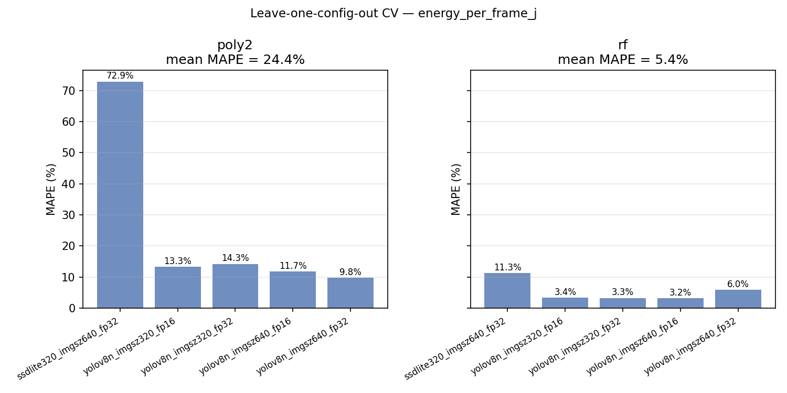
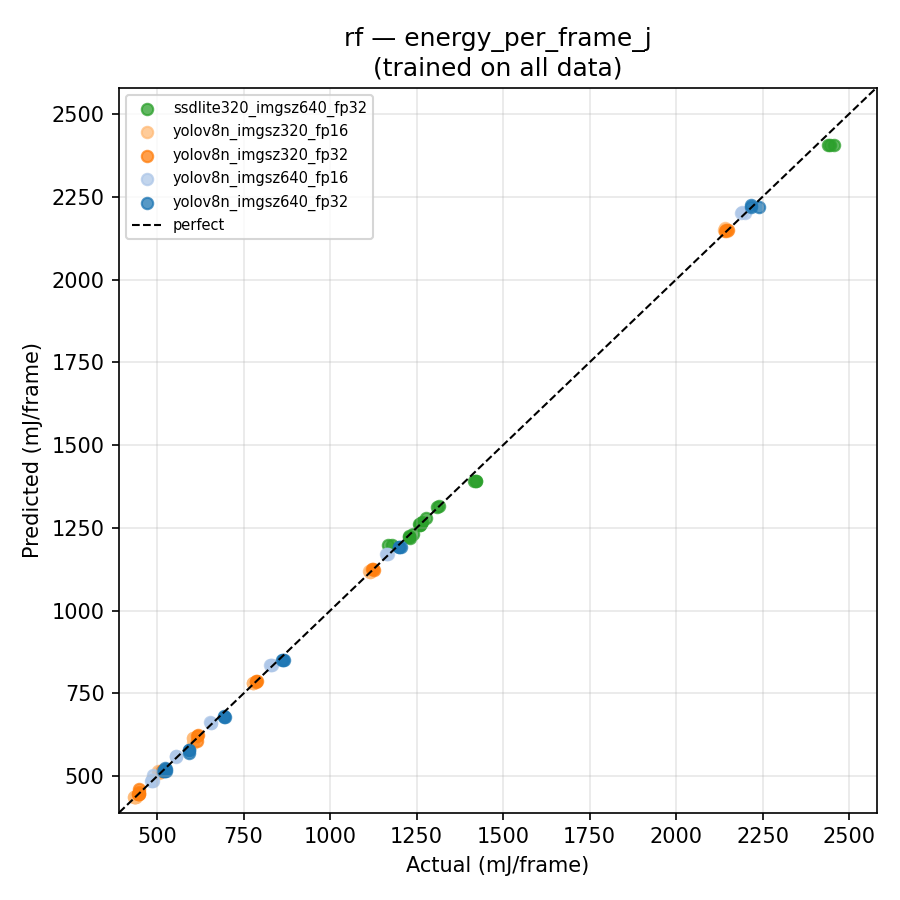
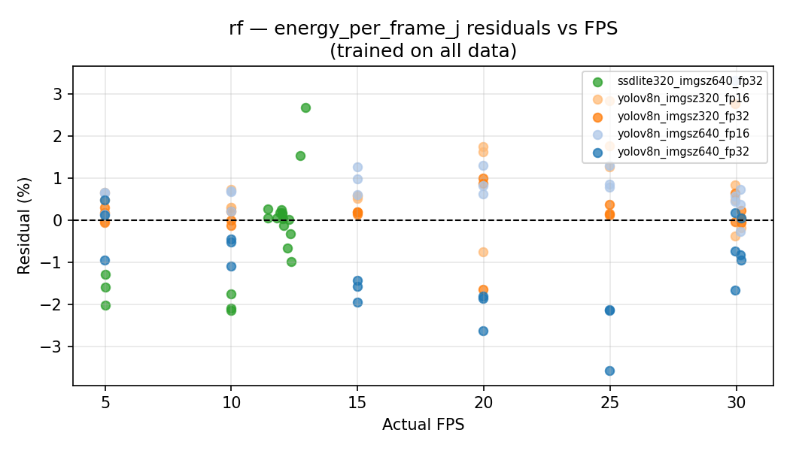
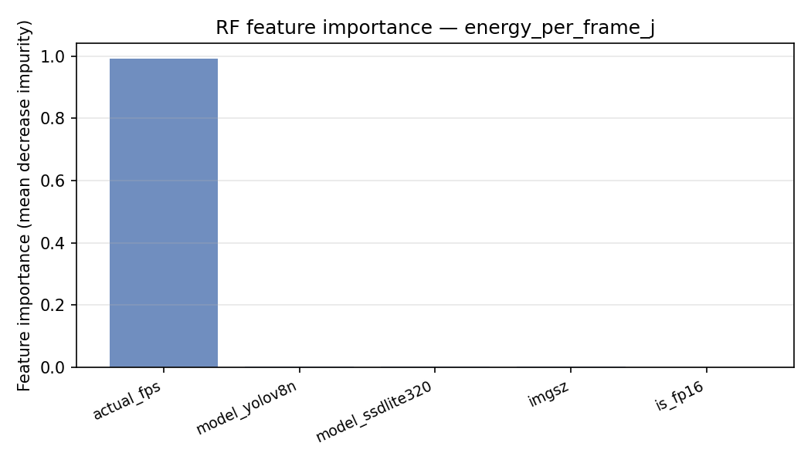

# Camera Energy Predictor — Analysis

**Platform:** Jetson AGX Orin Developer Kit (MAXN + `jetson_clocks`)  
**Training data:** 105 runs — 5 configs × 7 FPS targets × 3 repeats  
**Script:** `scripts/train_camera_predictor.py`  
**Saved model:** `models/camera_energy_predictor.pkl`

---

## 1. Problem Statement

The predictor answers: **given a model, inference resolution, precision, and target frame rate, how much energy will each frame consume and what will the mean power draw be?**

This enables offline trade-off analysis (e.g. "how much energy do I save by dropping from 30 to 15 FPS, or by switching from imgsz=640 to imgsz=320?") without running the benchmark.

---

## 2. Dataset

| Config | Model | imgsz | Precision | Rows | Energy range (mJ/frame) |
|---|---|---|---|---|---|
| `yolov8n_imgsz640_fp32` | YOLOv8n | 640 | fp32 | 21 | 517 – 2240 |
| `yolov8n_imgsz640_fp16` | YOLOv8n | 640 | fp16 | 21 | 484 – 2199 |
| `yolov8n_imgsz320_fp32` | YOLOv8n | 320 | fp32 | 21 | 445 – 2150 |
| `yolov8n_imgsz320_fp16` | YOLOv8n | 320 | fp16 | 21 | 434 – 2147 |
| `ssdlite320_imgsz640_fp32` | SSDLite320-MobileNetV3 | 640 | fp32 | 21 | 1166 – 2457 |
| **Total** | | | | **105** | |

Each config spans 7 FPS targets (0, 5, 10, 15, 20, 25, 30), averaged over 3 repeats. The wide energy range within each config (≈4–5× from low to high FPS) gives the regressor enough variation to learn the FPS–energy relationship.

---

## 3. Features and Targets

**Features** — all available before running the pipeline:

| Feature | Type | Values |
|---|---|---|
| `model_yolov8n` | Binary | 1 if YOLOv8n, 0 otherwise |
| `model_ssdlite320` | Binary | 1 if SSDLite320, 0 otherwise |
| `imgsz` | Numeric | 320 or 640 |
| `is_fp16` | Binary | 1 if fp16, 0 if fp32 |
| `actual_fps` | Numeric | Measured mean FPS (reflects hardware ceiling) |

`actual_fps` is used instead of `target_fps` to avoid the sentinel value `target_fps=0` (unbounded FPS) and to naturally capture saturation: YOLOv8n plateaus at ~30 FPS and SSDLite at ~12 FPS regardless of the FPS target, so the feature already encodes the operating regime.

**Targets:**
- `energy_per_frame_j` — primary
- `mean_power_w` — secondary

---

## 4. Models

Two estimators were trained and compared:

| Estimator | Description |
|---|---|
| **poly2** | `Pipeline(PolynomialFeatures(degree=2), Ridge(α=10))` — all degree-2 interaction terms |
| **rf** | `RandomForestRegressor(n_estimators=300, min_samples_leaf=2)` |

---

## 5. Evaluation — Leave-One-Config-Out Cross-Validation

Each of the 5 configs is held out in turn; the model is trained on the remaining 4 (84 rows) and evaluated on the held-out 21 rows. This tests out-of-config generalisation — the hardest scenario for a model trained on only 5 operating points.

### 5.1 Energy per Frame



| Config held out | poly2 MAPE | poly2 R² | RF MAPE | RF R² |
|---|---|---|---|---|
| `yolov8n_imgsz640_fp32` | 9.8% | 0.961 | 6.0% | 0.994 |
| `yolov8n_imgsz640_fp16` | 11.7% | 0.952 | 3.2% | 0.998 |
| `yolov8n_imgsz320_fp32` | 14.3% | 0.958 | 3.3% | 0.997 |
| `yolov8n_imgsz320_fp16` | 13.3% | 0.960 | 3.4% | 0.998 |
| `ssdlite320_imgsz640_fp32` | **72.9%** | −4.72 | **11.3%** | 0.807 |
| **Mean** | **24.4%** | −0.18 | **5.4%** | 0.959 |

**Polynomial regression** fails on the SSDLite holdout (MAPE 72.9%, R² = −4.7). The degree-2 surface fitted on YOLO data extrapolates poorly to SSDLite's fundamentally different operating regime (compute-bound at ~12 FPS vs camera-limited at ~30 FPS). When YOLO configs are held out, poly2 is adequate (10–14%) but still worse than RF.

**Random Forest** generalises well across all folds. YOLO holdouts achieve 3–6% MAPE with R² > 0.99. The SSDLite fold is harder (11.3%) but remains within a practically useful range — the RF correctly identifies that SSDLite operates in a higher-energy band and a lower FPS regime, even without having seen it during training.

### 5.2 Mean Power

| Config held out | RF MAPE | RF R² |
|---|---|---|
| `yolov8n_imgsz640_fp32` | 4.6% | 0.789 |
| `yolov8n_imgsz640_fp16` | 5.4% | 0.624 |
| `yolov8n_imgsz320_fp32` | 5.8% | 0.357 |
| `yolov8n_imgsz320_fp16` | 2.5% | 0.855 |
| `ssdlite320_imgsz640_fp32` | **18.8%** | −7.22 |
| **Mean** | **7.4%** | −0.92 |

Power prediction is harder than energy/frame prediction. The operating range is narrow (≈11–16 W), so the absolute MAE is small (~0.7 W) but the relative R² on CV is poor because most of the variance is explained by the FPS-independent idle floor. The SSDLite power fold is especially difficult: its mean power at low FPS (12.2 W @ 5 FPS) lies within the YOLO power band, but at unbounded FPS it reaches 15.1 W via a different trajectory. The RF learns the YOLO power–FPS curve and misapplies it to SSDLite.

**Energy per frame is the more reliable prediction target.** Power is provided as a secondary output but should be interpreted with ±1–2 W uncertainty for unseen architectures.

---

## 6. Predicted vs Actual



The RF fits the in-distribution data tightly (all points close to the diagonal). The SSDLite cluster (green) is slightly offset at low FPS but within the 11% MAPE reported by CV.

---

## 7. Residuals vs FPS



Residuals are centred near zero across the full FPS range for YOLO configs. The SSDLite residuals are slightly elevated at low FPS (~5 FPS) where the idle fraction makes it look more like a YOLO low-FPS point, and slightly negative near its 12 FPS ceiling. No systematic trend with FPS is visible for YOLO, confirming that the RF captures the non-linear FPS–energy curve correctly.

---

## 8. Feature Importance



| Feature | Importance |
|---|---|
| `actual_fps` | **99.2%** |
| `model_yolov8n` | 0.3% |
| `model_ssdlite320` | 0.2% |
| `imgsz` | 0.2% |
| `is_fp16` | 0.0% |

`actual_fps` dominates completely. This is consistent with the sweep analysis: energy/frame varies by ≈4–5× across FPS targets within any single config, whereas the effect of imgsz (≈14%) and fp16 (≈7%) are comparatively small. The model identity and resolution features are still necessary to set the correct baseline energy level and ceiling, but the dominant signal is always "how often is the pipeline sleeping vs running?"

The negligible importance of `is_fp16` does not mean fp16 is irrelevant — the 6–7% saving is real. It reflects that the RF tree splits do not need to isolate it explicitly because the fp16 points are already nearly on the fp32 curve (same FPS, slightly lower energy).

---

## 9. Selected Model

The RF is saved as the best estimator in `models/camera_energy_predictor.pkl`.

### Usage

```python
from camera_bench.predictor import load_predictor, predict_energy

pred = load_predictor()

result = predict_energy(pred,
                        model="yolov8n",
                        imgsz=640,
                        precision="fp32",
                        actual_fps=30.0)
# → {'energy_per_frame_j': 0.515, 'energy_per_frame_mj': 515.0,
#    'mean_power_w': 15.6, 'estimator': 'rf'}
```

### Sample predictions

| Model | imgsz | Precision | FPS | Predicted mJ/frame | Predicted W |
|---|---|---|---|---|---|
| YOLOv8n | 640 | fp32 | 30 | 515 | 15.6 |
| YOLOv8n | 640 | fp16 | 30 | 486 | 14.5 |
| YOLOv8n | 320 | fp32 | 30 | 448 | 13.4 |
| YOLOv8n | 640 | fp32 | 15 | 850 | 13.2 |
| YOLOv8n | 640 | fp32 | 5 | 2280 | 11.8 |
| SSDLite320 | 640 | fp32 | 12 | 1262 | 15.1 |
| SSDLite320 | 640 | fp32 | 5 | 2407 | 12.1 |

---

## 10. Limitations

1. **Only two models.** The training set spans one YOLO variant and one SSDLite variant. Predictions for unseen architectures (e.g. YOLOv8s, FasterRCNN) are extrapolations and should be treated as rough order-of-magnitude estimates until new sweep data is collected.

2. **FPS saturation must be handled by the caller.** The predictor clamps `actual_fps` to known hardware ceilings (30.2 FPS for YOLOv8n, 12.9 FPS for SSDLite) but does not know the ceiling for unseen models. Passing `actual_fps=30` for a model that saturates at 12 FPS will produce incorrect predictions.

3. **MAXN power mode only.** All training data was collected under `nvpmodel -m 0` with locked clocks. Predictions are not valid under other power modes (e.g. MODE_15W, MODE_10W) where GPU/CPU frequencies and idle power differ.

4. **Power prediction less reliable than energy/frame.** Mean MAPE 7.4% on CV and poor R² on SSDLite holdout — use with ±1–2 W uncertainty for unseen configs.
