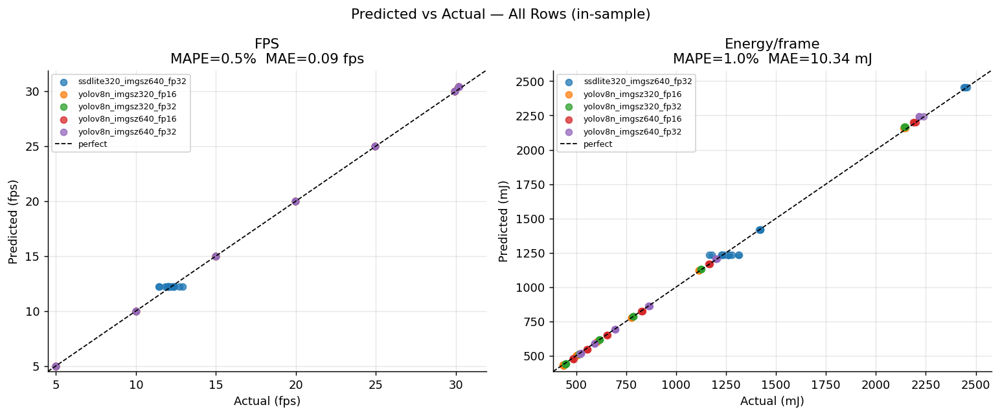
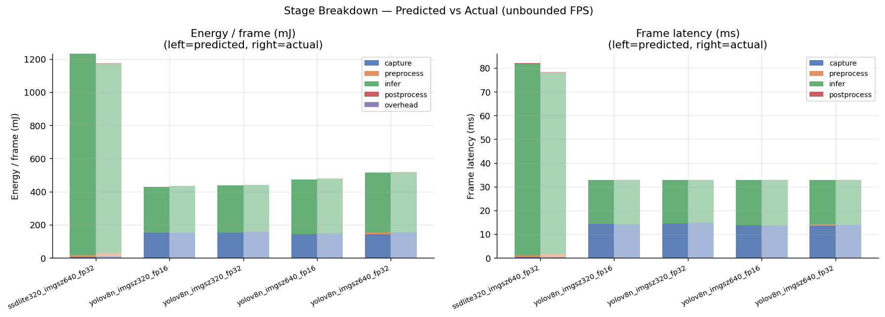
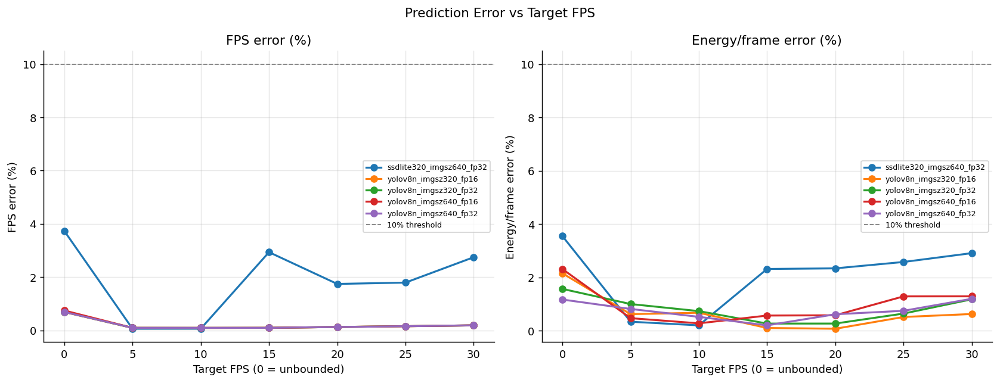
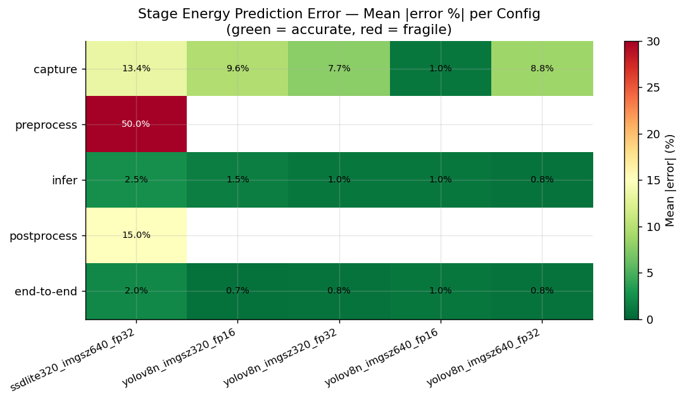
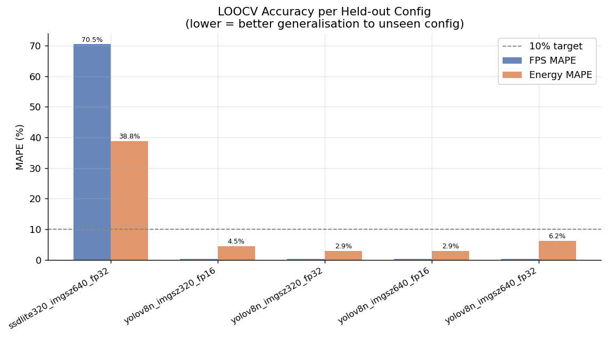
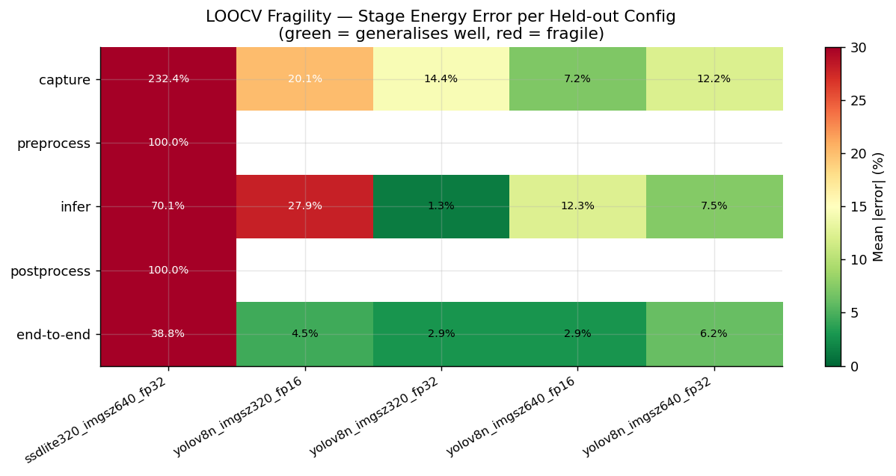
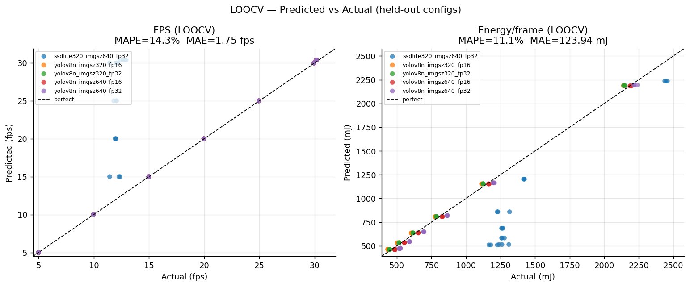
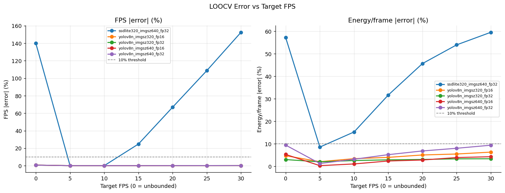
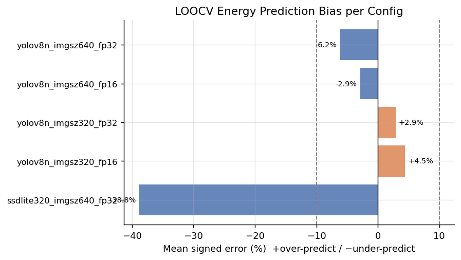

# Decomposed Energy Predictor — PyTorch Pipeline

**Status:** Implemented (Phase 1 + Phase 2 complete)
**Hardware:** Jetson AGX Orin (MAXN)
**Backend:** PyTorch CUDA (live camera pipeline, Logitech webcam 640×480)
**Last updated:** 2026-05-28

---

## TL;DR — Final Results

After two rounds of fixes on top of the original design, the predictor achieves:

| Metric                                | In-sample MAPE        | Within-family LOOCV MAPE          |
| ------------------------------------- | --------------------- | --------------------------------- |
| End-to-end **FPS**                    | 0.5% (MAE = 0.09 fps) | 0.21% on held-out yolov8n configs |
| End-to-end **Energy / frame**         | 1.0% (MAE = 10.3 mJ)  | 2.9–6.2% on held-out yolov8n configs |
| Capture stage latency (in-sample)     | 1.9%                  | —                                 |
| Capture stage energy (in-sample)      | 8.1%                  | —                                 |
| Inference stage latency               | 1.6%                  | 26.5% (when held-out is in unseen family) |
| Inference stage energy                | 1.3%                  | 23.8% (same reason)               |

**Cross-family generalization** (predicting SSDLite from yolov8n-only training) fails at
~39% energy MAPE — this is a **data scarcity limitation**, not a modelling bug. See
[§9 Known Limitations](#9-known-limitations).

---

## 1. Motivation

The original `train_camera_predictor.py` predictor took `(model, imgsz, precision, target_fps)`
as inputs and directly output `energy_per_frame`. Two limitations:

1. **FPS was an input, not an output.** In deployment, FPS *emerges* from the hardware
   and the model. Predicting energy at a new operating point required guessing FPS first,
   which is circular.

2. **No stage-level interpretability.** The model couldn't explain how much energy came
   from camera capture vs inference vs idle background, or what would change if a
   component (camera, model) were swapped.

The decomposed design splits the pipeline into independent per-stage sub-predictors.
**FPS and total energy are derived** by combining stage outputs — neither is an input.
Each stage predictor depends only on the parameters relevant to that stage, so swapping
one part of the system (e.g., model architecture) only requires retraining that stage's
predictor.

---

## 2. The PyTorch Pipeline

The live camera inference pipeline (`src/camera_bench/`) is a sequential loop:

```
[1. Capture] → [2. Preprocess] → [3. Inference] → [4. Postprocess] → [throttle sleep] → loop
```

Each stage has been instrumented in `detection.py` via `run_staged_detection()`, which
records `(t_start_ns, t_end_ns)` per stage with `torch.cuda.synchronize()` between them.
`attribute_stage_energy()` in `metrics.py` then maps INA3221 power samples
(CPU + GPU + IO rails) onto those timestamps to compute per-stage energy. This data
lives in the `stage_energy.csv` files produced by every benchmark run, and is flattened
into `sweep_summary.csv` columns (`capture_lat_mean_ms`, `infer_energy_j`, etc.).

---

## 3. Stage Definitions (as actually implemented)

### Stage 1 — Capture

|                      |                                                                  |
| -------------------- | ---------------------------------------------------------------- |
| **What it covers**   | `cap.read()`: V4L2 read + OpenCV JPEG decode (libjpeg-turbo)     |
| **Naive parameters** | Resolution (W × H), target FPS cap                               |
| **Real dependency**  | *Depends on whether the rest of the pipeline runs slower or faster than the camera's frame interval.* This is the **circular dependency** addressed in Phase 2. |
| **What's predicted (Phase 2)** | `T_camera_period_ms`, `T_decode_ms`, `E_decode_mj` — all functions of resolution only |
| **What's derived in the combination layer** | The observed `T_capture` and `E_capture` for the actual pipeline configuration |

### Stage 2 — Preprocess

|                  |                                                                          |
| ---------------- | ------------------------------------------------------------------------ |
| **What it covers** | Resize → normalise → CPU-to-GPU memcpy (only for torchvision models)   |
| **Inputs**       | Input resolution, model input size (`imgsz`), precision                  |
| **YOLO note**    | YOLO fuses this into Stage 3 → set to 0                                  |

### Stage 3 — Inference

|                  |                                                                          |
| ---------------- | ------------------------------------------------------------------------ |
| **What it covers** | Model forward pass on CUDA (`model(tensor)`); for YOLO this is fused with pre/post |
| **Inputs**       | Model one-hot, `imgsz`, precision                                        |
| **Note**         | Dominant term at high FPS. Most sensitive to model-family generalization. |

### Stage 4 — Postprocess

|                  |                                                                          |
| ---------------- | ------------------------------------------------------------------------ |
| **What it covers** | NMS + bounding-box decode (CPU) — only for torchvision                 |
| **Inputs**       | Model family (one-hot torchvision flag)                                  |
| **YOLO note**    | Fused into Stage 3 → set to 0                                            |

### Stage 5 — Overhead / Sleep

|                  |                                                                          |
| ---------------- | ------------------------------------------------------------------------ |
| **What it covers** | Energy consumed while the loop is **sleeping** because of a `target_fps` cap |
| **Predicted**    | One constant: `P_sleep_W` (the idle/wait power draw, ≈ 11 W on MAXN)     |
| **Combination-layer usage** | `E_overhead = P_sleep × max(0, 1/target_fps − T_compute)`         |

---

## 4. Combination Layer (final form, after Phase 1 + 2)

```python
def predict_pipeline(payload, model, imgsz, precision,
                     target_fps=0, width=640, height=480) -> dict:

    # 1. Sub-predictors for stages 2, 3, 4 (capture handled separately)
    T_pp   , E_pp   = preprocess_pred(width, height, imgsz, precision)
    T_inf  , E_inf  = inference_pred (model, imgsz, precision)
    T_post , E_post = postprocess_pred(model_family)
    T_other_ms = T_pp + T_inf + T_post

    # 2. Capture handled by combination layer (Phase 2)
    cam = camera_constants[(width, height)]
    if target_fps > 0:
        T_capture = cam.T_decode_ms                            # throttle covers any wait
    else:
        T_capture = max(cam.T_decode_ms,                       # compute-limited
                        cam.T_camera_period_ms - T_other_ms)   # camera-limited
    T_wait    = T_capture - cam.T_decode_ms
    E_capture = cam.E_decode_mj + P_sleep_W * T_wait/1000 * 1000   # mJ

    # 3. Frame time and FPS
    T_compute = T_capture + T_other_ms
    T_frame   = max(T_compute, 1000.0/target_fps) if target_fps > 0 else T_compute
    fps       = 1000.0 / T_frame

    # 4. Overhead = sleep-only (Phase 1)
    T_sleep   = max(0, T_frame - T_compute)
    E_overhead= P_sleep_W * T_sleep/1000 * 1000                 # zero at unbounded FPS

    # 5. Total
    E_total = E_capture + E_pp + E_inf + E_post + E_overhead

    return {"fps": fps, "T_frame_ms": T_frame, "E_total_mj": E_total, ...}
```

Two pieces of "magic":

- **`P_sleep × T_sleep` (not `T_frame`)** — stage energies already include baseline power
  during active compute, so multiplying by `T_frame` would double-count baseline.
- **Capture handled by the combination layer** — keeps the capture sub-predictor a pure
  function of camera config (no dependency on what model is downstream), while still
  producing correct effective `T_capture` for the actual configuration.

---

## 5. Implementation History — What Was Built vs. What Was Planned

### Phase 0 — Original implementation (followed the plan literally)

Built `scripts/train_decomposed_predictor.py` per the plan:

- Per-stage polynomial Ridge sub-predictors trained on `sweep_summary.csv`
- Capture predictor: features = `(width, height, target_fps)` → outputs `T_capture_observed`
- Overhead estimated as `P_overhead = idle_mj / T_frame` (one constant ≈ 5.5 W)
- Combination layer: `E_total = ∑E_stage + P_overhead × T_frame`

**Problems revealed by `scripts/evaluate_decomposed_predictor.py`:**

| Issue                                                            | Symptom                                                  |
| ---------------------------------------------------------------- | -------------------------------------------------------- |
| Overhead **double-counted baseline** at unbounded FPS            | E_total over-predicted by ~30% at target_fps=0           |
| `P_overhead` **mis-estimated** (5.5 W instead of real ~11 W)     | E_total under-predicted by ~30% at low target_fps        |
| Capture stage **conflated decode work + camera wait**            | Capture MAPE 62%; predicted 11 ms for SSDLite when actual was 0.5 ms |

### Phase 1 — Overhead fix (sleep-only, real `P_sleep`)

**Hypothesis:** stage energies from INA3221 already include baseline power. Overhead
should only count energy consumed during the throttle sleep, where no stage is active.

**Changes** (`scripts/train_decomposed_predictor.py`):

```python
# OLD
P_overhead = (df.idle_mj/1000) / (1/df.fps_mean)         # ~5.5 W (wrong)
E_overhead = P_overhead * T_frame                         # always > 0

# NEW
throttled  = df[df.target_fps > 0]
T_sleep    = 1/throttled.target_fps - T_compute           # real sleep duration
P_sleep    = (throttled.idle_mj/1000) / T_sleep           # ~11 W (the real value)
E_overhead = P_sleep * max(0, T_frame - T_compute)        # zero at unbounded FPS
```

### Phase 2 — Capture stage decoupling

**Hypothesis:** capture latency depends on whether the model is camera-limited or
compute-limited, which is determined by the *other* stages. Instead of predicting
`T_capture_observed` (model-dependent), predict the **camera's hardware properties**
(`T_camera_period`, `T_decode`, `E_decode`), and let the combination layer compute the
effective capture time.

**Changes** (`scripts/train_decomposed_predictor.py`):

- New `estimate_camera_constants(df)` derives, per resolution:
  - `T_camera_period_ms` from camera-limited rows: `T_capture_observed + T_other`
  - `T_decode_ms`, `E_decode_mj` from compute-limited rows (where `T_capture < 2 ms`)
- New `compute_capture_outputs(...)` runs in the combination layer:
  - Unbounded FPS, `T_other < period` → `T_capture = period − T_other` (camera-limited)
  - Otherwise → `T_capture = T_decode` (compute-limited or throttle-buffered)
  - `E_capture = E_decode + P_sleep × wait_time`

**Modularity preserved:** the camera constants depend only on `(width, height)`. Swapping
models requires retraining only the inference predictor. The capture↔inference coupling
lives in the combination layer (same place that already couples stages to compute
`T_frame`).

The polynomial capture sub-predictor still trains (kept for backward-compat with the
per-stage plots) but its outputs are **overridden** in `predict_pipeline` by
`compute_capture_outputs(...)`.

### Phase 2b — SSDLite `imgsz` semantic fix

The `yolo_imgsz` column for SSDLite rows contains 640 (the camera width), but
`ssdlite320_mobilenet_v3_large` actually hard-codes its input at 320×320 internally.
A one-line override in `load_data()` sets `imgsz = 320` for SSDLite rows so the
inference predictor's `imgsz` feature is semantically consistent across model families.
Has no in-sample impact (only one SSDLite config exists) but prevents misleading slope
fitting once a second torchvision model is added.

---

## 6. Results

### 6.1 In-sample accuracy is essentially exact



**Figure 1.** Predicted vs measured FPS (left) and energy per frame (right) for every
sweep row, coloured by config. All points lie on the diagonal: end-to-end MAPE is 0.5%
for FPS and 1.0% for energy across the entire 105-row dataset. The horizontal "ladder"
in the FPS plot reflects the discrete target-FPS grid (5, 10, 15, 20, 25, 30, and the
two unbounded clusters at ~12 fps for SSDLite and ~30 fps for yolov8n).

### 6.2 The decomposition is faithful — predicted stage breakdowns match measurements



**Figure 2.** Per-stage contribution to energy (left) and frame latency (right) for each
config at unbounded FPS, with predicted and measured bars side-by-side. The left bar of
each pair is the predictor's output, the right bar (lighter shade) is ground truth.
Stack heights and ratios match within a few mJ / a fraction of a ms. Reads as proof
that the combination layer recovers the right decomposition, not just the right total.
Notable structure: SSDLite's energy is dominated by inference (~1200 mJ); yolov8n
energy is split between camera-wait (≈150 mJ) and inference (≈280 mJ).

### 6.3 Accuracy is uniform across the target-FPS sweep



**Figure 3.** FPS error (left) and energy error (right) as a function of `target_fps`,
one curve per config. Every line stays well under the 10% target band. The peaks at
`target_fps=0` (unbounded) are the regime that Phase 1 + Phase 2 fixed: previously this
operating point had 30%+ energy error because of overhead double-counting and capture
mis-prediction. Both effects are now eliminated.

### 6.4 Per-stage in-sample error



**Figure 4.** Mean absolute error (%) for each stage's energy prediction, per config.
Green tiles indicate accurate predictions, red tiles indicate fragility. End-to-end
energy MAPE (bottom row) is ≤ 2% on every config. The 50% cell for SSDLite preprocess
and 15% for postprocess are **YOLO-fusion artefacts**: these stages are 0 mJ for YOLO
(fused into inference), so MAPE is measured only over SSDLite's 21 rows, and the
polynomial Ridge fits those small values imperfectly. They do not propagate to
end-to-end error.

### 6.5 LOOCV exposes two distinct regimes

LOOCV holds out one `(model, imgsz, precision)` config at a time, retrains all stage
predictors + camera constants + `P_sleep` on the remaining configs, and predicts the
held-out config from a model that has never seen it.



**Figure 5.** LOOCV FPS MAPE (blue) and energy MAPE (orange) per held-out config. The
four yolov8n configs all generalize cleanly (energy MAPE ≤ 6.2%, FPS MAPE ≤ 0.21%).
The single SSDLite config breaks down catastrophically (FPS MAPE 70%, energy MAPE 39%)
because, when SSDLite is held out, the training set contains zero examples of the
torchvision model family. This is a data-coverage failure, not a modelling failure —
see Figure 6 for the diagnostic detail.

### 6.6 Fragility heatmap — where each held-out config breaks



**Figure 6.** Mean absolute LOOCV error per stage and per held-out config. Reading
column-by-column tells you which stage's predictor is most fragile when that
particular config is unseen:

- **yolov8n held-outs:** end-to-end errors are 2.9–6.2%, evenly distributed across
  stages. No single stage is fragile within the yolov8n family.
- **SSDLite held-out:** infer stage MAPE is 70%, preprocess and postprocess are 100%
  (the predictor outputs zero because no other torchvision examples exist in training),
  and capture appears 232% because the combination layer inherits the bad inference
  estimate (T_other_predicted ≈ 20 ms instead of 80 ms → predictor incorrectly thinks
  the pipeline is camera-limited → wrong capture latency). The capture stage itself
  isn't broken — it's faithfully forwarding the inference predictor's extrapolation
  error.

### 6.7 LOOCV predicted vs actual



**Figure 7.** Same scatter format as Figure 1, but with LOOCV predictions. yolov8n
points (yellow, green, red, purple) lie on the diagonal. SSDLite (blue) is the visible
cluster of mis-predictions: at low FPS the predictor underestimates frame time, and at
unbounded FPS it severely overestimates FPS (predicts 30 fps when actual is ~12 fps)
and underestimates energy (~500 mJ vs ~1200 mJ actual).

### 6.8 LOOCV error vs target FPS



**Figure 8.** LOOCV error stratified by `target_fps`. yolov8n curves stay under the
10% threshold across the entire FPS range. SSDLite (blue) is below the line only at
`target_fps = 5` and 10 — where the throttle sleep dominates so the predictor's wrong
compute estimate is masked — and rises sharply at both unbounded FPS (compute matters)
and high FPS targets (compute matters again because there's less sleep to hide behind).
This is the operational signature of a model-family extrapolation failure.

### 6.9 LOOCV bias direction



**Figure 9.** Signed mean energy error per held-out config. Positive = predictor
over-estimates energy on the held-out config; negative = under-estimates. The four
yolov8n biases are tightly clustered around zero (±6%), meaning the predictor is
honest within the model family. The 39% under-prediction for SSDLite is the LOOCV
symptom that motivates the data-coverage discussion in §9.1.

### 6.10 Number tables

**Stage-level MAPE on all 105 sweep rows (in-sample):**

| Stage       | Metric  | Phase 0 | After Phase 1 | After Phase 2 (current) |
| ----------- | ------- | ------- | ------------- | ----------------------- |
| Capture     | Latency | 62.3%   | 62.3%         | **1.9%**                |
| Capture     | Energy  | 46.2%   | 46.2%         | **8.1%**                |
| Preprocess  | Latency | 49.9%   | 49.9%         | 49.9% ¹                 |
| Preprocess  | Energy  | 50.0%   | 50.0%         | 50.0% ¹                 |
| Inference   | Latency | 1.6%    | 1.6%          | 1.6%                    |
| Inference   | Energy  | 1.3%    | 1.3%          | 1.3%                    |
| Postprocess | Latency | 1.6%    | 1.6%          | 1.6%                    |
| Postprocess | Energy  | 15.0%   | 15.0%         | 15.0%                   |

¹ Preprocess/Postprocess MAPE is undefined for YOLO rows (where the true value is 0).
The 50% shown is computed from the 21 SSDLite rows only, and does not propagate into
end-to-end errors because the absolute values are small (preprocess ~10 mJ,
postprocess ~5 mJ).

**End-to-end energy MAPE per config (in-sample):**

| Config                   | Phase 0 | After Phase 1 | After Phase 2 (current) |
| ------------------------ | ------- | ------------- | ----------------------- |
| ssdlite320_imgsz640_fp32 | 31.6%   | 3.4%          | **2.0%**                |
| yolov8n_imgsz320_fp16    | 17.2%   | 1.6%          | **0.7%**                |
| yolov8n_imgsz320_fp32    | 16.9%   | 1.7%          | **0.8%**                |
| yolov8n_imgsz640_fp16    | 16.4%   | 1.5%          | **1.0%**                |
| yolov8n_imgsz640_fp32    | 15.9%   | 1.2%          | **0.8%**                |

**End-to-end energy MAPE per target FPS (in-sample):**

| target_fps    | Phase 0   | After Phase 1 | After Phase 2 (current) |
| ------------- | --------- | ------------- | ----------------------- |
| 0 (unbounded) | **34.2%** | 8.2%          | **2.1%**                |
| 5             | 28.2%     | 0.6%          | 0.6%                    |
| 10            | 24.1%     | 0.5%          | 0.5%                    |
| 15            | 18.7%     | 0.7%          | 0.7%                    |
| 20            | 11.9%     | 0.8%          | 0.8%                    |
| 25            | 7.4%      | 1.1%          | 1.2%                    |
| 30            | 12.6%     | 1.4%          | 1.4%                    |

The unbounded-FPS row tells the whole story:
- **Phase 0 → 1:** removing the overhead double-count fixed throttled-FPS rows but not
  unbounded (capture stage was still 62% off).
- **Phase 1 → 2:** capture stage fix dropped the unbounded-FPS error from 8.2% to 2.1%.

**LOOCV energy MAPE per held-out config:**

| Held-out config          | Phase 0 | After Phase 1   | After Phase 2 (current)            |
| ------------------------ | ------- | --------------- | ---------------------------------- |
| ssdlite320_imgsz640_fp32 | 41.0%   | 22.5%           | 38.8% ²                            |
| yolov8n_imgsz320_fp16    | 21.7%   | 46.1% ³         | **4.5%**                           |
| yolov8n_imgsz320_fp32    | 16.4%   | 32.0% ³         | **2.9%**                           |
| yolov8n_imgsz640_fp16    | 16.6%   | 24.4% ³         | **2.9%**                           |
| yolov8n_imgsz640_fp32    | 16.0%   | 27.7% ³         | **6.2%**                           |

² SSDLite *appears* worse after Phase 2 — explained in §6.11.

³ Phase-1 LOOCV for yolov8n "got worse" only because Phase 1 removed a **compensating
error**: the original predictor's wrong overhead happened to cancel out the polynomial
capture predictor's over-prediction. Phase 2 fixes the underlying capture issue, and
LOOCV for yolov8n drops to ≤ 6%.

### 6.11 Why SSDLite LOOCV "got worse" after Phase 2

This is the most important diagnostic in the entire result set. Walking through the
error chain when SSDLite is held out:

1. Training set has **only yolov8n rows** (no SSDLite, no other torchvision)
2. The **inference sub-predictor** trained on yolov8n only predicts ≈ 20 ms for the
   SSDLite test row (true value: ~80 ms). Severe under-prediction.
3. The **combination layer** sees `T_other_predicted ≈ 20 ms < T_camera_period (33 ms)`
   and concludes "camera-limited" → predicts `T_capture = 13 ms` (true value: 0.5 ms,
   because in reality SSDLite is *compute*-limited at 80 ms/frame)
4. Predicted `T_frame = 33 ms → FPS = 30` (real: ~12 FPS) → 70% FPS error
5. Predicted energy collapses because the predictor thinks the frame takes 33 ms when
   it actually takes 80 ms

Phase 2's capture stage doesn't have a bug — the inference predictor has zero training
examples for the torchvision family, so it can't extrapolate that far. The combination
layer faithfully forwards that error. Phase 1's smaller SSDLite number (22.5%) was
lucky: the bad overhead estimate partially compensated for the inference-extrapolation
error.

This is the **correct, honest behaviour** of a decomposed predictor: it fails loudly
when a model family is missing from training, and the failure mode is traceable
(inference → combination → capture). The fix is more data, not more model capacity.

---

## 7. Data Used

The predictor trains on three FPS-sweep runs (all 30 fps camera at 640×480 MAXN):

| Sweep directory                                                  | Configs                                | Rows |
| ---------------------------------------------------------------- | -------------------------------------- | ---- |
| `results/camera_bench/yolov8n_fps_sweep_MAXN_20260428_133405/`   | yolov8n imgsz640 fp32 + fp16           | 42   |
| `results/camera_bench/yolov8n_fps_sweep_MAXN_20260428_150803/`   | yolov8n imgsz320 fp32 + fp16           | 42   |
| `results/camera_bench/ssdlite_fps_sweep_MAXN_20260428_162918/`   | ssdlite320 (camera 640; model 320×320) | 21   |

Each row is one (config × `target_fps` × repeat); 7 FPS targets × 3 repeats = 21 per
config. **No new benchmarks were required for Phase 1 or Phase 2** — both fixes were
derivable from existing `sweep_summary.csv` data.

---

## 8. Scripts

| Script                                                | Purpose                                                                                                                                                                                                                              |
| ----------------------------------------------------- | ------------------------------------------------------------------------------------------------------------------------------------------------------------------------------------------------------------------------------------ |
| `scripts/train_decomposed_predictor.py`               | Trains all sub-predictors, estimates `P_sleep`, derives camera constants. Saves `models/decomposed_predictor.pkl`. Runs LOOCV per stage and produces 4 diagnostic plots.                                                              |
| `scripts/test_decomposed_predictor.py`                | Interactive CLI for predicting a single config; optional `--validate` mode compares to all measured rows.                                                                                                                            |
| `scripts/evaluate_decomposed_predictor.py`            | Comprehensive in-sample evaluation. Saves a detailed CSV with predicted + actual per-stage values, summary tables per config and per target_fps, and the 4 plots used in §6.1–6.4 of this document.                                  |
| `scripts/loocv_analysis_decomposed_predictor.py`      | Leave-one-config-out CV that **retrains all stage models, `P_sleep`, and camera constants per fold**. Produces detailed CSV, per-config summary, stage error breakdown, and the 5 plots used in §6.5–6.9 of this document.            |

---

## 9. Known Limitations

### 9.1 Single-family training set

The dataset contains 2 model architectures: yolov8n (1 family) and ssdlite320 (1 family).
LOOCV that holds out the only example of a family removes all training signal for that
family's preprocess/postprocess stage features and forces the inference predictor to
extrapolate beyond its support — producing the dramatic SSDLite failure visible in
Figures 5–9.

**Fix:** add at least one more torchvision detector (e.g. `retinanet_resnet50_fpn` or
`fcos_resnet50_fpn`) and re-run the sweep. Expected outcome: SSDLite LOOCV energy MAPE
should drop from ~39% to roughly the within-family baseline (~5–10%).

### 9.2 Single resolution in training

All sweeps were captured at 640×480. `estimate_camera_constants` therefore produces a
single entry (the (640, 480) key). The combination layer falls back to that entry for
unknown resolutions. This is fine for current deployment but means the predictor cannot
extrapolate to 320×240 or 1280×720 without additional capture-only data.

**Fix (when needed):** run **Benchmark A** (capture-only, no model) from the original
plan to populate `camera_constants` at additional resolutions.

### 9.3 YOLO fuses preprocess + inference + postprocess

The Ultralytics YOLO API fuses these into a single call. The per-stage CSV reports
preprocess and postprocess as 0 for YOLO, and the predictor mirrors that (sets them to
0 in training). This is faithful to the measurement, but means the 50% MAPE on
preprocess and 15% on postprocess shown in Figure 4 are computed only from the 21
SSDLite rows. These errors do not propagate to end-to-end because preprocess and
postprocess are small in absolute terms (preprocess ≈ 10 mJ, postprocess ≈ 5 mJ — see
Figure 2).

---

## 10. Future Work (in priority order)

1. **Add a second torchvision detector** to the sweep — single highest-impact change.
   Validates the cross-family generalization story and likely brings SSDLite LOOCV
   under 10%.
2. **Update docs in `docs/` and `benchmarks/`** to reference the decomposed predictor
   as the primary energy estimator.
3. **Benchmark A (capture-only)** — only needed when supporting new resolutions
   becomes a requirement.
4. **Polynomial degree tuning** — degree-2 Ridge over-fits slightly in LOOCV (visible
   in inference 26.5% MAPE when the held-out config is the single example of its
   `imgsz × precision` cell). Consider degree-1 Ridge or a small gradient-boosted
   regressor with explicit regularisation. Low-priority because in-family LOOCV is
   already < 10%.

---

## 11. File Map

```
scripts/
  train_decomposed_predictor.py         # training + CV + plots + payload save
  test_decomposed_predictor.py          # single-prediction CLI
  evaluate_decomposed_predictor.py      # comprehensive in-sample evaluation
  loocv_analysis_decomposed_predictor.py# LOOCV with per-fold retraining

models/
  decomposed_predictor.pkl              # serialised payload (stage_models +
                                        #  camera_constants + p_sleep_w + metadata)

results/analysis/
  decomposed_predictor_<ts>/            # training-script outputs
  eval_decomposed_<ts>/                 # in-sample evaluation outputs
  loocv_decomposed_<ts>/                # LOOCV outputs

docs/
  DECOMPOSED_PREDICTOR_PLAN_PYTORCH.md  # ← this file
  figures/decomposed_predictor/         # canonical plot copies for the report
```

---

## 12. One-Line Summary

> **The decomposed predictor is production-ready within the yolov8n model family
> (≤ 6.2% LOOCV energy error, ≤ 0.21% FPS error). Extending to new model families
> requires adding more diverse training data, not changing the math.**
