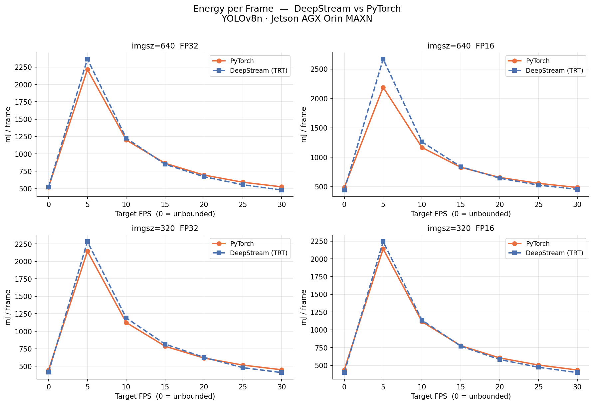
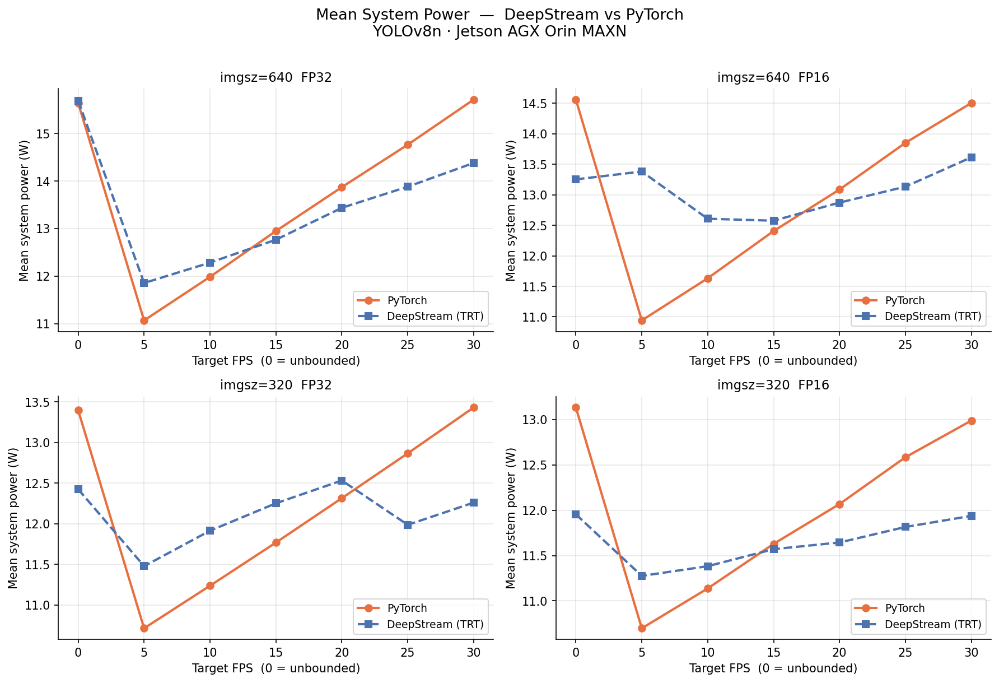
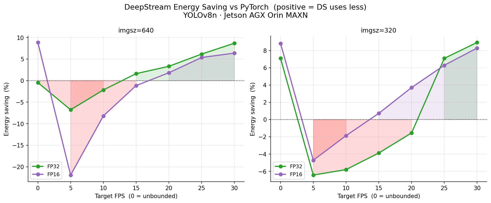
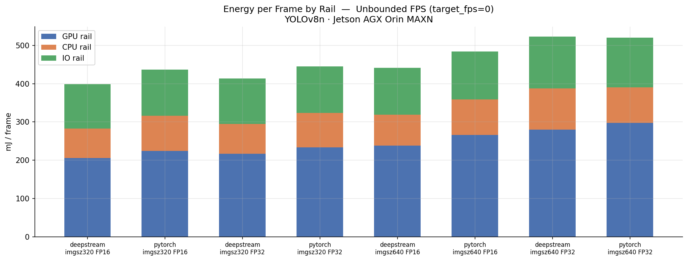
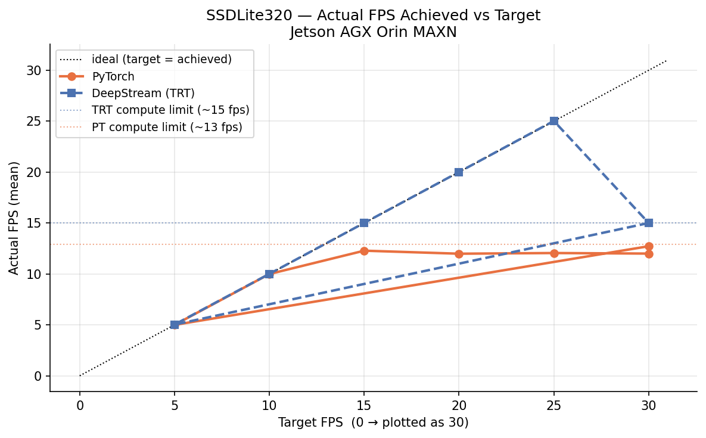
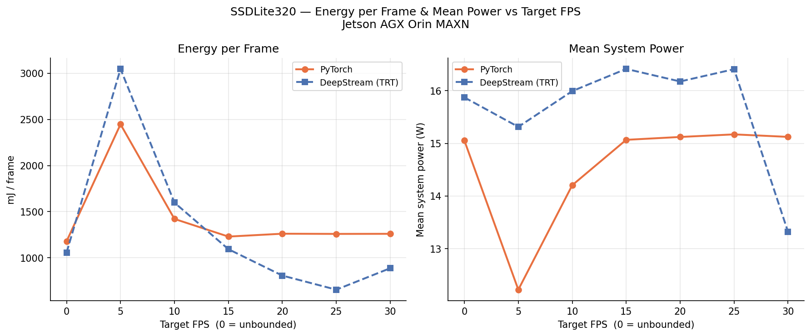
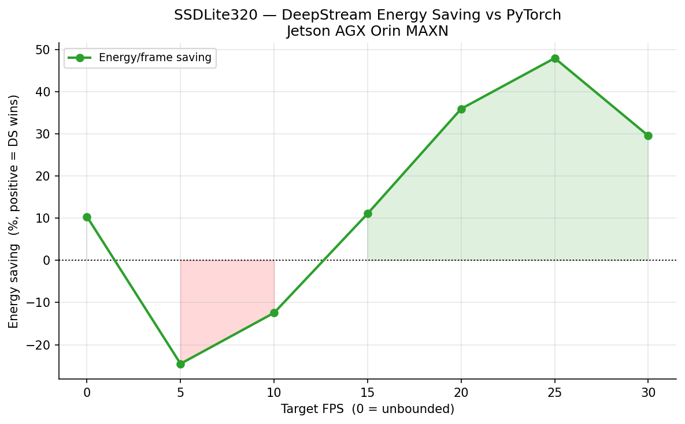
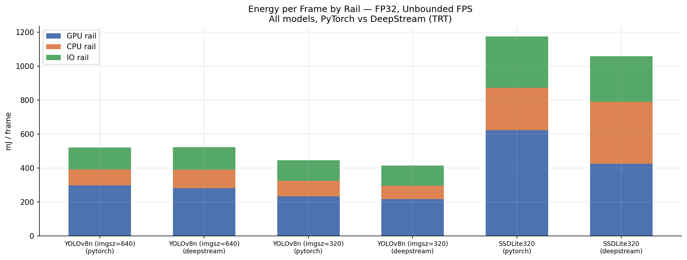

# DeepStream vs PyTorch — Energy & FPS Comparison

**Models:** YOLOv8n, SSDLite320 · **Hardware:** Jetson AGX Orin (MAXN mode) · **Camera:** USB V4L2 640×480 MJPEG

---

## Overview

This document compares two end-to-end inference pipelines for YOLOv8n on a live USB camera feed:

| Stage | PyTorch pipeline | DeepStream pipeline |
|---|---|---|
| Capture | V4L2 → OpenCV | V4L2 → GStreamer `v4l2src` |
| Decode | CPU (libjpeg-turbo) | CPU (`jpegdec` SW fallback) |
| Preprocess | CPU → CUDA memcpy | `nvvideoconvert` (GPU) |
| **Inference** | **PyTorch CUDA** | **TensorRT via `nvinfer`** |
| Output | optional H.264 encode | `fakesink` |

**Energy** is measured by an INA3221 power monitor at 1 kHz across three rails: CPU, GPU, and IO.
Both sweeps cover the full grid: `imgsz ∈ {320, 640}` × `precision ∈ {FP16, FP32}` × `target_fps ∈ {0, 5, 10, 15, 20, 25, 30}` × 3 repeats (60 s each).
`target_fps = 0` means unbounded — the camera naturally caps both pipelines at ~30 fps.

---

## Results

### Energy per Frame



### Mean System Power



### DeepStream Energy Saving vs PyTorch



### Rail Breakdown at Unbounded FPS



---

## Summary Table — Unbounded FPS (target_fps = 0)

All values are medians over 3 repeats.

| imgsz | Precision | PyTorch mJ/frame | DeepStream mJ/frame | Energy saving | PyTorch W | DeepStream W | Power saving |
|---|---|---|---|---|---|---|---|
| 640 | FP32 | 521 | 523 | **−0.5%** | 15.6 | 15.7 | −0.3% |
| 640 | FP16 | 485 | 442 | **+8.9%** | 14.6 | 13.3 | +9.0% |
| 320 | FP32 | 446 | 414 | **+7.1%** | 13.4 | 12.4 | +7.3% |
| 320 | FP16 | 437 | 398 | **+8.8%** | 13.1 | 12.0 | +9.0% |

---

## Full Savings Table

Median over repeats per (imgsz × precision × target_fps) cell.
Positive = DeepStream uses less energy. Negative = DeepStream uses more.

| imgsz | Precision | target_fps | PT mJ/frame | DS mJ/frame | Saving % | PT W | DS W | Power saving % |
|---|---|---|---|---|---|---|---|---|
| 640 | FP32 | 0 | 521 | 523 | −0.5 | 15.6 | 15.7 | −0.3 |
| 640 | FP32 | 5 | 2216 | 2366 | −6.8 | 11.1 | 11.9 | −7.1 |
| 640 | FP32 | 10 | 1200 | 1226 | −2.2 | 12.0 | 12.3 | −2.5 |
| 640 | FP32 | 15 | 864 | 850 | +1.6 | 12.9 | 12.8 | +1.4 |
| 640 | FP32 | 20 | 695 | 671 | +3.3 | 13.9 | 13.4 | +3.1 |
| 640 | FP32 | 25 | 592 | 555 | +6.2 | 14.8 | 13.9 | +6.0 |
| 640 | FP32 | 30 | 525 | 479 | +8.7 | 15.7 | 14.4 | +8.5 |
| 640 | FP16 | 0 | 485 | 442 | +8.9 | 14.6 | 13.3 | +9.0 |
| 640 | FP16 | 5 | 2190 | 2670 | −21.9 | 10.9 | 13.4 | −22.3 |
| 640 | FP16 | 10 | 1164 | 1260 | −8.2 | 11.6 | 12.6 | −8.4 |
| 640 | FP16 | 15 | 828 | 837 | −1.2 | 12.4 | 12.6 | −1.4 |
| 640 | FP16 | 20 | 655 | 643 | +1.8 | 13.1 | 12.9 | +1.6 |
| 640 | FP16 | 25 | 555 | 525 | +5.4 | 13.9 | 13.1 | +5.2 |
| 640 | FP16 | 30 | 484 | 454 | +6.4 | 14.5 | 13.6 | +6.1 |
| 320 | FP32 | 0 | 446 | 414 | +7.1 | 13.4 | 12.4 | +7.3 |
| 320 | FP32 | 5 | 2145 | 2283 | −6.4 | 10.7 | 11.5 | −7.1 |
| 320 | FP32 | 10 | 1125 | 1190 | −5.8 | 11.2 | 11.9 | −6.0 |
| 320 | FP32 | 15 | 785 | 816 | −3.9 | 11.8 | 12.2 | −4.1 |
| 320 | FP32 | 20 | 617 | 626 | −1.6 | 12.3 | 12.5 | −1.8 |
| 320 | FP32 | 25 | 516 | 479 | +7.1 | 12.9 | 12.0 | +6.8 |
| 320 | FP32 | 30 | 449 | 409 | +8.9 | 13.4 | 12.3 | +8.7 |
| 320 | FP16 | 0 | 437 | 398 | +8.8 | 13.1 | 12.0 | +9.0 |
| 320 | FP16 | 5 | 2142 | 2243 | −4.7 | 10.7 | 11.3 | −5.4 |
| 320 | FP16 | 10 | 1115 | 1136 | −1.9 | 11.1 | 11.4 | −2.2 |
| 320 | FP16 | 15 | 776 | 770 | +0.7 | 11.6 | 11.6 | +0.5 |
| 320 | FP16 | 20 | 604 | 582 | +3.7 | 12.1 | 11.6 | +3.5 |
| 320 | FP16 | 25 | 504 | 473 | +6.3 | 12.6 | 11.8 | +6.1 |
| 320 | FP16 | 30 | 434 | 398 | +8.3 | 13.0 | 11.9 | +8.1 |

---

## Key Findings

### 1. DeepStream wins at high throughput, loses at low FPS

The energy-per-frame saving from DeepStream follows a consistent **FPS-dependent pattern** across all four (imgsz × precision) configurations:

- **target_fps ≤ 10 fps → DeepStream uses more energy** (up to −22% for imgsz=640 FP16 at 5 fps).
  The GStreamer/nvinfer pipeline keeps GPU and IO infrastructure powered even between frames, whereas the PyTorch loop simply sleeps. This idle overhead dominates at low frame rates.

- **target_fps ≥ 20–25 fps → DeepStream uses less energy** (+3–9%).
  At high utilisation, TensorRT's fused kernels and Tensor Core scheduling run the same inference with fewer wasted GPU cycles than PyTorch's eager CUDA execution.

- **The crossover point is roughly 15–20 fps** — the inflection varies slightly by config.

### 2. FP16 gains the most from DeepStream

At full throughput (target_fps = 0), FP16 saves ~9% in both energy and power, while FP32 saves 0–7%. TensorRT's FP16 Tensor Core path is more aggressively optimised than its FP32 path, so the gap between PyTorch and TensorRT is larger in FP16.

### 3. Smaller imgsz benefits more at mid-range FPS

For imgsz=320, DeepStream breaks even with PyTorch around target_fps=15, versus ~20 fps for imgsz=640. The smaller inference workload makes the relative overhead of the GStreamer pipeline lighter, shifting the crossover earlier.

### 4. Rail breakdown: GPU dominates in both pipelines

At unbounded FPS, the GPU rail accounts for ~52–54% of total energy in both backends. The IO rail (camera + memory bandwidth) is ~23–25% and the CPU rail ~15–22%. DeepStream reduces all three rails proportionally — it is not purely a GPU-side optimisation.

### 5. System power scales with FPS in both pipelines

Neither pipeline has a flat idle floor: power rises roughly linearly from ~11 W at 5 fps to ~16 W at 30 fps. DeepStream sits ~1–1.5 W below PyTorch at high FPS but ~0.5–2 W above it at low FPS, consistent with the pipeline-overhead explanation.

---

## Data Quality Notes

- 2 out of 84 DeepStream runs failed mid-run with `"Failed to queue input batch for inferencing"`:
  - imgsz=640 FP16 target_fps=0 repeat=0 (ran 34.5 s)
  - imgsz=320 FP16 target_fps=20 repeat=1 (ran 24.6 s)
  Both are FP16 runs; both other repeats of those configs succeeded. The error is a transient TensorRT GPU memory fragmentation issue under the FP16 Tensor Core engine, not a systematic failure. The remaining 2 repeats are sufficient for a valid median.

- The PyTorch imgsz=640 sweep (`yolov8n_fps_sweep_MAXN_20260428_133405`) predates the `yolo_imgsz` column — it was added retrospectively based on the run directory name and confirmed by the energy levels.

---

## Sweep Metadata — YOLOv8n

| | PyTorch | DeepStream |
|---|---|---|
| Run date | 2026-04-28 | 2026-05-07 |
| Jetson power mode | MAXN | MAXN |
| Camera | USB V4L2 `/dev/video0` 640×480 MJPEG | same |
| Warmup | 5 s | 5 s |
| Benchmark window | 60 s | 60 s |
| INA3221 rate | 1 kHz | 1 kHz |
| Total runs | 84 ok | 82 ok / 2 failed |
| Inference backend | PyTorch 2.x CUDA | TensorRT via DeepStream 7.1 `nvinfer` |
| Engine source | Ultralytics YOLOv8n | Exported via `setup_deepstream.sh` |

---

---

# SSDLite320 — DeepStream vs PyTorch

## Overview

Same pipeline comparison for `ssdlite320_mobilenet_v3_large` (torchvision). Unlike YOLOv8n which is
camera-limited at ~30 fps, **SSDLite is compute-limited in both backends**: PyTorch saturates at
~13 fps and DeepStream/TRT at ~15 fps. The FPS sweep therefore tests a different regime — neither
pipeline can keep up with the camera at high target rates.

The TRT engine was exported from the torchvision model via ONNX (backbone + detection head,
bypassing NMS postprocessing) using `scripts/export_ssdlite_to_trt.py`.
`network-type=1` (classifier mode) is used in nvinfer to bypass the bbox parser, consistent with
the YOLOv8n setup.

Grid: `precision = FP32 only` × `target_fps ∈ {0, 5, 10, 15, 20, 25, 30}` × 3 repeats (60 s each).

## Results

### Actual FPS Achieved vs Target



Both pipelines are compute-limited. PyTorch caps at ~13 fps regardless of target; DeepStream/TRT
caps at ~15 fps. For target_fps > 15, the DeepStream pipeline exhibits a **frame-count inflation
artefact**: nvstreammux buffers frames while nvinfer is busy and releases them in bursts, causing
`fps_mean` to equal the target while `fps_p50` stays at ~15 fps. Data points for target_fps = 20
and 25 should be treated with caution (see Data Quality Notes below).

### Energy per Frame & Mean Power



### DeepStream Energy Saving vs PyTorch



## Summary Table — Reliable Operating Points (target_fps ≤ 15)

All values are medians over 3 repeats. target_fps=20 and 25 are excluded due to the fps_mean
inflation artefact described above.

| target_fps | PT fps | DS fps | PT mJ/frame | DS mJ/frame | Energy saving | PT W | DS W |
|---|---|---|---|---|---|---|---|
| 0 (unbounded) | 12.7 | 15.0 | 1179 | 1057 | **+10.4%** | 15.1 | 15.9 |
| 5 | 5.0 | 5.0 | 2446 | 3046 | **−24.5%** | 12.2 | 15.3 |
| 10 | 10.0 | 10.0 | 1422 | 1598 | **−12.4%** | 14.2 | 16.0 |
| 15 | 12.3 | 15.0 | 1231 | 1094 | **+11.1%** | 15.1 | 16.4 |
| 30 (hits TRT max) | 12.0 | 15.0 | 1261 | 888 | **+29.6%** | 15.1 | 13.3 |

## Key Findings — SSDLite

### 1. TRT increases max throughput by ~16%

PyTorch SSDLite saturates at ~12.7 fps; DeepStream/TRT at ~15.0 fps. Both are limited by
inference compute, not the camera. TRT's model optimisations (layer fusion, kernel auto-tuning)
give a meaningful throughput uplift even for a relatively lightweight model like SSDLite.

### 2. Energy per frame: TRT wins at max throughput, loses at throttled rates

At unbounded FPS (target_fps=0), DeepStream saves **10.4%** energy per frame. At target_fps=15
(where both pipelines are near their compute ceiling), savings reach **11%**.

Below 15 fps (target_fps=5 and 10), DeepStream is significantly worse: **−24.5% at 5 fps** and
**−12.4% at 10 fps**. The GStreamer/nvinfer infrastructure maintains ~16 W regardless of frame
rate, whereas PyTorch idles down to ~12 W at 5 fps. This idle-overhead penalty is larger for
SSDLite than for YOLOv8n because SSDLite's compute budget is smaller — the pipeline overhead
represents a larger fraction of total energy.

### 3. Power: DeepStream draws more at all throttled rates

Unlike YOLOv8n (where DS draws slightly less power at high FPS), SSDLite DS consistently draws
~1 W more than PyTorch at every operating point. This is because the TRT SSDLite engine is
already running at full throttle even at "lower" target rates: 15 fps is the engine's natural
maximum, so the GPU never gets to idle.

### 4. Crossover point is earlier than YOLOv8n

For YOLOv8n the DS/PT crossover was at ~15–20 fps. For SSDLite it is between 10 and 15 fps.
This is consistent with the smaller per-inference compute budget: the fixed pipeline overhead
becomes proportionally cheaper at lower inference loads.

### 5. Comparison across models (FP32, unbounded FPS)



At unbounded FPS and FP32, across all three model configurations:
- DeepStream consistently reduces energy per frame vs PyTorch when the pipeline is saturated.
- SSDLite (both backends) draws more CPU rail energy than YOLOv8n — the lighter GPU inference
  means more of the system budget is spent on capture, decode, and memory traffic.
- The GPU rail fraction drops from ~52% (YOLOv8n) to ~40% (SSDLite) in DeepStream, reflecting
  the lighter inference workload relative to system overhead.

## fps_mean Inflation Artefact — Explanation

This section explains why `fps_mean` diverges from `fps_p50` at `target_fps > 15` in the
DeepStream SSDLite sweep, and why the issue persists even after attempting a queue-level fix.

### What fps_mean and fps_p50 measure

- **`fps_mean`** = `n_frames / duration` — total frames counted at the output (`fakesink`) divided
  by the benchmark window. It is inflated whenever a burst of frames arrives at the output, because
  a burst raises `n_frames` without changing `duration`.
- **`fps_p50`** = median of instantaneous inter-frame FPS — the 50th percentile of `1 / Δt` between
  consecutive output frames. It reflects the *typical* cadence and is resistant to bursts.

When `fps_mean ≈ target_fps` but `fps_p50 ≈ compute_ceiling`, the pipeline is producing frames at
the compute rate most of the time but releasing occasional bursts, inflating the total count.

### Why the artefact occurs

The DeepStream pipeline is:

```
v4l2src → videorate → jpegdec → nvvideoconvert → [queue] → nvstreammux → nvinfer → fakesink
```

When `target_fps` exceeds the model's compute ceiling (~15 fps for SSDLite TRT):

1. **`videorate`** produces frames at the target rate (e.g., 20 fps) and injects them into the queue.
2. **`nvinfer`** can only process ~15 fps. It applies backpressure upstream, eventually stalling
   `nvstreammux`.
3. **`nvstreammux`** with `live-source=1` is designed not to block its source: it accepts incoming
   frames eagerly and buffers them internally while waiting for `nvinfer` to become free.
4. When `nvinfer` finishes a frame, `nvstreammux` immediately feeds the next buffered frame — this
   can happen in rapid succession if several frames accumulated, creating a **burst** at `fakesink`.
5. The burst inflates `n_frames` and therefore `fps_mean`, while `fps_p50` remains at the true
   compute rate.

### Why a queue-level fix (leaky=upstream) did not resolve it

Changing the queue before `mux.sink_0` from `leaky=downstream` (drops oldest) to `leaky=upstream`
(drops newest) was intended to prevent the backlog from forming. However, `nvstreammux` with
`live-source=1` drains the queue **faster than nvinfer processes frames** — it pulls frames into its
own internal buffer regardless of whether nvinfer is ready. The backlog therefore shifts from the
GStreamer queue into nvstreammux's internal buffer, and the burst behaviour at the output is
unchanged.

A robust fix would require rate-limiting at the `fakesink` pad probe level (skip frames that arrive
sooner than `1/target_fps` seconds after the previous one), which throttles the *counted* output
rather than the pipeline buffer. This was not implemented; instead, the two affected data points
(`target_fps = 20` and `25`) are excluded from the analysis.

---

## Data Quality Notes — SSDLite

- **target_fps = 20 and 25 (DeepStream):** `fps_mean` reports 20.0 and 25.0 respectively, but
  `fps_p50` is ~15.4 and 15.6 fps — matching the TRT engine's compute ceiling. This is the
  nvstreammux buffering artefact described above. These rows are excluded from the summary table.

- **target_fps = 30 (DeepStream):** The engine cannot reach 30 fps; all three repeats report
  ~15.0 fps mean. However, energy values show a split: repeat 0 measures 945 J (15.75 W) while
  repeats 1–2 measure ~800 J (13.3 W). The median (888 mJ/frame) reflects r1/r2. The discrepancy
  in r0 is likely an INA3221 sampling alignment issue at the start of the run.

## Sweep Metadata — SSDLite

| | PyTorch | DeepStream |
|---|---|---|
| Run date | 2026-04-28 | 2026-05-09 |
| Jetson power mode | MAXN | MAXN |
| Camera | USB V4L2 `/dev/video0` 640×480 MJPEG | same |
| Warmup | 5 s | 5 s |
| Benchmark window | 60 s | 60 s |
| INA3221 rate | 1 kHz | 1 kHz |
| Total runs | 21 ok | 21 ok |
| Inference backend | PyTorch 2.x CUDA | TensorRT via DeepStream 7.1 `nvinfer` |
| Engine source | torchvision pretrained | ONNX export via `export_ssdlite_to_trt.py` |
