# Predictor Analysis — Holdout Evaluation
> **Analysis run:** `results/analysis/predictor_holdout_20260331_143155/`
> **Predictor:** one `HistGradientBoostingRegressor` per model, trained independently for each energy target
> **Targets:** `energy_cpu_J`, `energy_gpu_J`, `energy_io_J`, `energy_total_J`
> **Target unit:** total energy over 200 inference iterations (Joules); power in Watts
> **Test set:** 25% holdout — 233 samples across 11 models per target
> **Date:** 2026-03-31

---

> ⚠️ **Note on ViT-B/16:** This model only supports resolution 224×224, which means it produced only 9 rows in the full dataset (3 batches × 3 precisions). After the 75/25 train/test split, only **3 test samples** remain — one per batch size, all at the same resolution. This is insufficient to evaluate the predictor reliably. ViT-B/16 is **excluded from all plots** in this document to avoid distorting the scale and misleading the analysis. Its raw metrics are reported in the tables for completeness but should not be interpreted as statistically meaningful.

---

## 0. Setup

One predictor is trained per model architecture, per energy target — resulting in 4 × 11 = 44 independent models. Features used: `flops_total`, `batch`, `resolution`, `precision`. A log1p transform is applied to all targets before training. `energy_total_J` is the sum of CPU + GPU + I/O energy and represents the full system energy budget.

---

## 1. Overall Performance

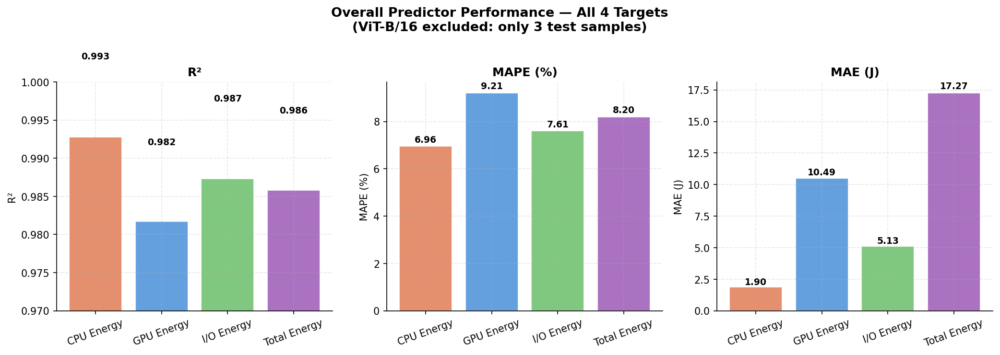

| Target | MAE (J) | RMSE (J) | R² | MAPE (%) |
|---|---|---|---|---|
| `energy_cpu_J` | 1.90 | 4.65 | **0.9928** | 6.96% |
| `energy_gpu_J` | 10.49 | 21.55 | 0.9817 | 9.21% |
| `energy_io_J` | 5.13 | 11.41 | 0.9873 | 7.61% |
| `energy_total_J` | 17.27 | 36.98 | 0.9858 | 8.20% |

All four targets achieve R² above 0.98, which is encouraging. However, as with any wide-range dataset, the R² is partly inflated by SSDLite's extreme values dominating the variance. MAPE is a more honest measure of per-prediction quality.

**GPU energy is the hardest target to predict** (highest MAPE at 9.21%, lowest R²). This is consistent with the data analysis finding that GPU energy is more sensitive to resolution and precision interactions, and varies more non-linearly with batch. CPU energy remains the easiest target despite its small absolute scale.

**Total energy** (MAE=17.27 J) accumulates the errors from all three components — but it does not simply sum them, as individual errors can partially cancel. Its MAPE of 8.2% is close to the average of the three components, suggesting errors are largely additive.

---

## 2. Per-Model Performance

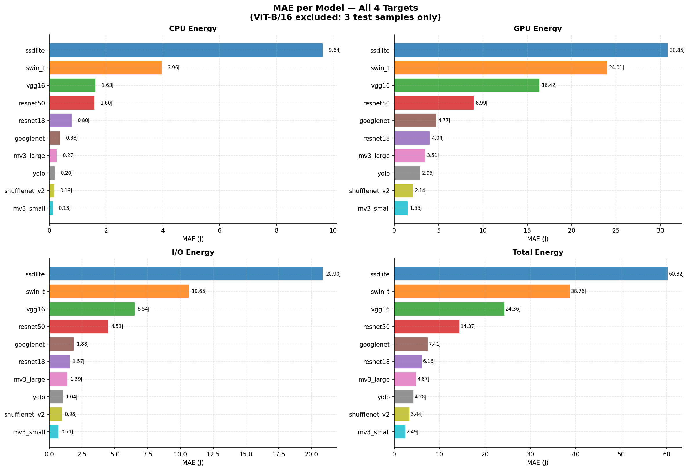

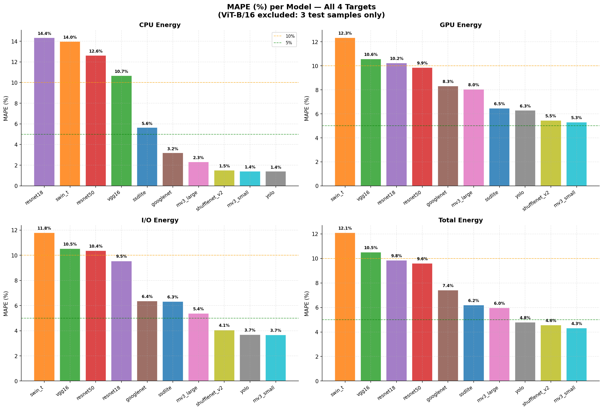

### 2.1 MAE Rankings

| Model | CPU MAE (J) | GPU MAE (J) | I/O MAE (J) | Total MAE (J) |
|---|---|---|---|---|
| mobilenet_v3_small | 0.13 | 1.55 | 0.71 | 2.49 |
| shufflenet_v2_x1_0 | 0.19 | 2.14 | 0.98 | 3.44 |
| yolo | 0.20 | 2.95 | 1.04 | 4.28 |
| mobilenet_v3_large | 0.27 | 3.51 | 1.39 | 4.87 |
| googlenet | 0.38 | 4.77 | 1.88 | 7.41 |
| resnet18 | 0.80 | 4.04 | 1.57 | 6.16 |
| resnet50 | 1.60 | 8.99 | 4.51 | 14.37 |
| vgg16 | 1.63 | 16.42 | 6.54 | 24.36 |
| swin_t | 3.96 | 24.01 | 10.65 | 38.76 |
| ssdlite | 9.64 | 30.85 | 20.90 | 60.32 |
| vit_b_16 ⚠️ | 3.20 | 53.65 | 13.94 | 65.31 |

### 2.2 MAPE Rankings

| Model | CPU MAPE | GPU MAPE | I/O MAPE | Total MAPE |
|---|---|---|---|---|
| mobilenet_v3_small | 1.42% | 5.31% | 3.67% | 4.31% |
| yolo | 1.40% | 6.28% | 3.69% | 4.80% |
| shufflenet_v2_x1_0 | 1.52% | 5.45% | 4.06% | 4.56% |
| mobilenet_v3_large | 2.33% | 8.05% | 5.38% | 5.97% |
| googlenet | 3.19% | 8.31% | 6.36% | 7.41% |
| resnet18 | **14.35%** | 10.24% | 9.55% | 9.84% |
| resnet50 | 12.63% | 9.86% | 10.37% | 9.61% |
| vgg16 | 10.67% | 10.56% | 10.53% | 10.50% |
| ssdlite | 5.64% | 6.47% | 6.32% | 6.19% |
| swin_t | 13.98% | 12.35% | 11.78% | 12.09% |
| vit_b_16 ⚠️ | 26.02% | **80.30%** | **41.50%** | **59.60%** |

**Key observations:**

- **Flat-energy models (MobileNet, ShuffleNet, YOLO) predict best across all four targets.** Their energy barely varies with configuration, so the predictor has little variance to explain. MAPE stays below 2% for CPU and below 6.5% for GPU.

- **SSDLite has acceptable MAPE (~6%) but enormous absolute error** (total MAE = 60 J). This is not a contradiction: its energy range is so wide (54–334 J for CPU alone) that a 6% relative error corresponds to large absolute deviations. The predictor captures the trend but not the fine-grained variation.

- **ResNet18 and ResNet50 have the worst CPU MAPE (14% and 13%)** despite small absolute error. Their CPU energy is low and sensitive to configuration interactions that the predictor does not fully capture.

- **GPU error is 5–20× larger in absolute terms than CPU error** for all models — a direct consequence of GPU energy being the dominant and most variable component. Even a MAPE of 9% on GPU translates into tens of joules of absolute error for heavy models.

---

## 3. Predicted vs Actual

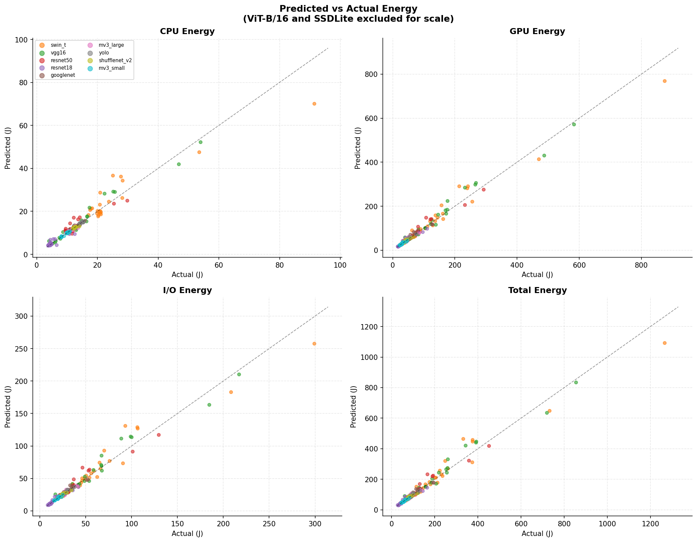

Points cluster tightly along the diagonal for lightweight models across all four targets. For GPU and Total energy, the spread widens for Swin-T, VGG16, and ResNet50 at high batch sizes. SSDLite is excluded from these plots for scale — its range would compress all other models into a single cluster.

---

## 4. Effect of Batch Size on Prediction Error

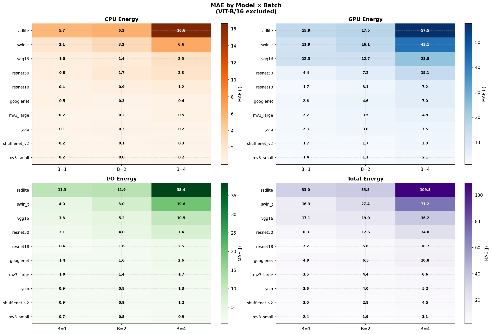

Batch size is the single most impactful sweep parameter on prediction error. The pattern is consistent across all four targets:

**Flat models (MobileNet, ShuffleNet, YOLO):** error is stable across batch sizes for all targets. The predictor correctly learns that energy barely changes with batch for these models.

**Compute-heavy models (ResNet, VGG, Swin-T, SSDLite):** error grows sharply at batch=4. Selected examples:

| Model | Target | B=1 MAE | B=4 MAE | Factor |
|---|---|---|---|---|
| ssdlite | GPU | 15.9 J | **57.5 J** | ×3.6 |
| swin_t | GPU | 11.9 J | **43.1 J** | ×3.6 |
| resnet50 | GPU | 4.4 J | **15.1 J** | ×3.4 |
| ssdlite | Total | 33.0 J | **109.3 J** | ×3.3 |
| swin_t | Total | 16.3 J | **71.2 J** | ×4.4 |

For SSDLite specifically, the negative R² values at all batch sizes indicate that the predictor performs worse than a constant baseline — it consistently underestimates SSDLite's energy at all batch levels, failing to capture the near-linear scaling pattern.

---

## 5. Effect of Resolution on Prediction Error

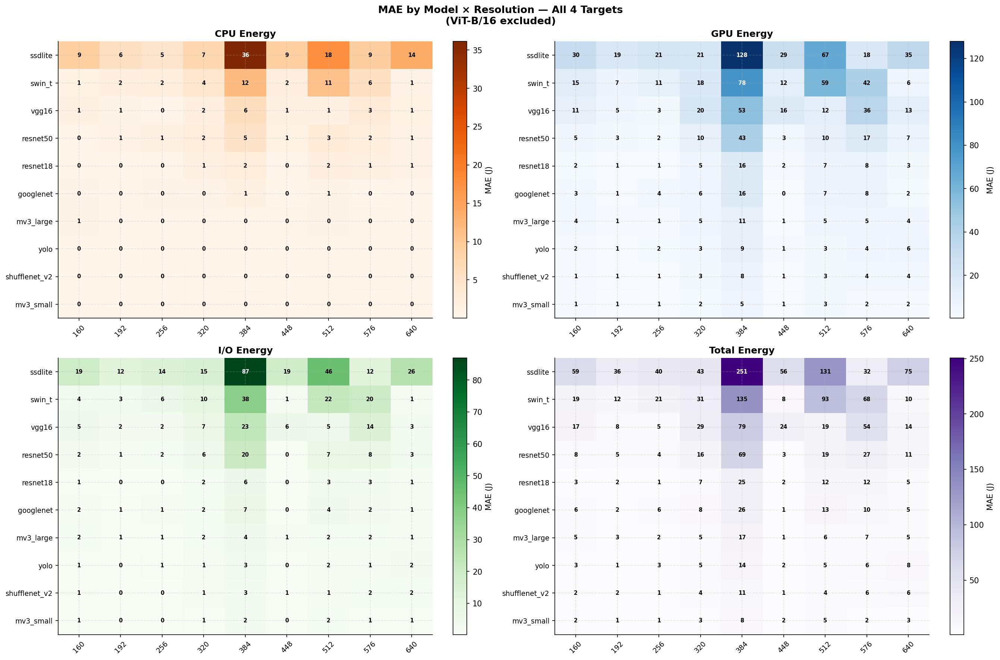

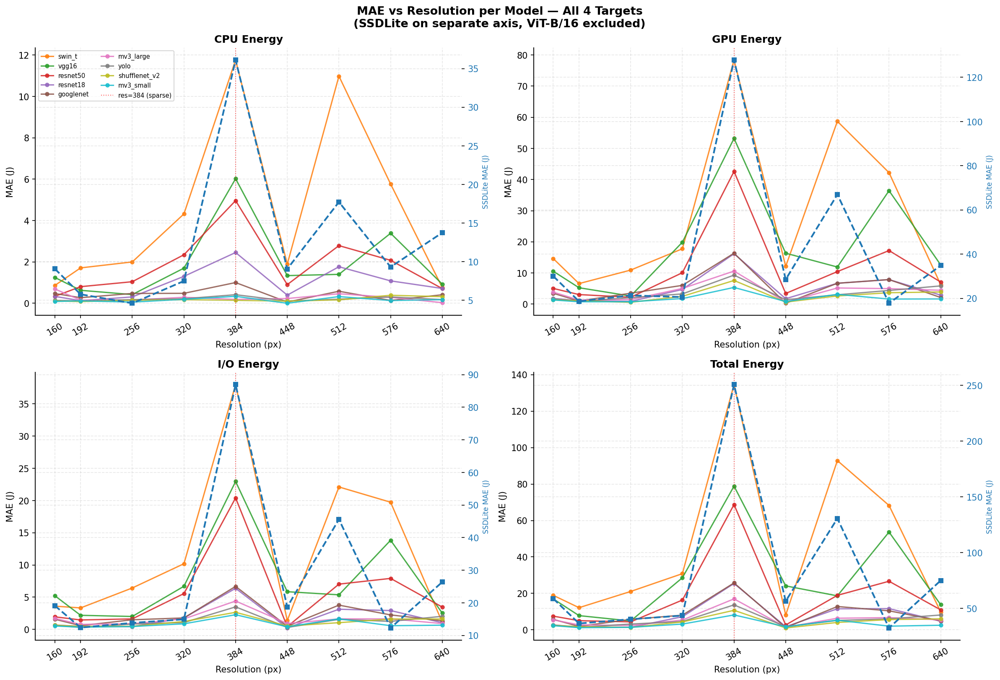

Resolution exerts a concentrated but severe influence on prediction error: errors are broadly low and stable across most resolution values, but collapse catastrophically at **resolution = 384**, which is the single most under-represented resolution in the test set (one holdout sample per model).

### 5.1 The res=384 Spike

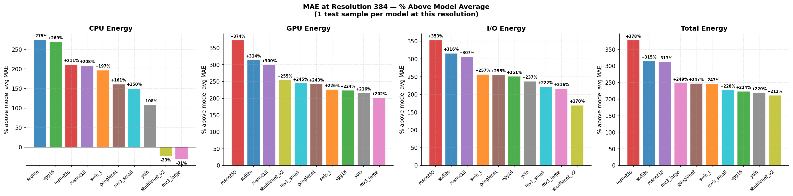

Across all four energy targets, resolution 384 produces MAE values that are systematically between **+150% and +380% above each model's own average MAE.** Selected examples for the GPU target:

| Model | res=256 MAE | res=384 MAE | % above avg |
|---|---|---|---|
| resnet50 | 2.2 J | **42.6 J** | +374% |
| ssdlite | 21.4 J | **127.9 J** | +315% |
| swin_t | 10.9 J | **78.4 J** | +227% |
| vgg16 | 2.6 J | **53.2 J** | +224% |
| resnet18 | 0.9 J | **16.2 J** | +300% |

The same pattern holds for all other targets (CPU, I/O, Total). The spike is **not model-specific**: every model, including the lightweight ones (MobileNet, ShuffleNet, YOLO), shows elevated error at res=384, though the absolute magnitude scales with the model's baseline energy consumption.

### 5.2 Root Cause: Sampling Sparsity

The res=384 spike is a **data sparsity artefact**, not a fundamental limitation of the predictor. The sweep configuration produced only a single test sample at resolution=384 per model (after 75/25 train-test split). This means:

1. The predictor has no opportunity to average across multiple configurations at this resolution — a single outlier configuration fully determines the reported MAE.
2. The one holdout configuration at res=384 tends to be batch=4 + fp16, which is independently the hardest configuration to predict (as established in Sections 4 and 6), compounding the error.

At all other resolutions (160–640, excluding 384), prediction error follows a smooth and interpretable trend, generally increasing with resolution due to higher absolute energy values.

### 5.3 Resolution Trend Outside the Spike

Beyond the res=384 anomaly, error increases gradually with resolution, particularly for compute-heavy models (ResNet50, Swin-T, VGG16). This is expected: higher resolutions produce higher absolute energy values, and a fixed relative prediction error translates to a larger absolute MAE. For lightweight models (MobileNet, ShuffleNet, YOLO), the absolute MAE remains low across all resolutions, consistent with these models' insensitivity to resolution shown in the sweep analysis.

SSDLite remains an outlier at all resolutions due to its internal 320×320 resizing: the predictor receives resolution as a feature but the actual computation is constant. This creates a structurally misleading input that the predictor cannot fully compensate for.

---

## 6. Effect of Precision on Prediction Error

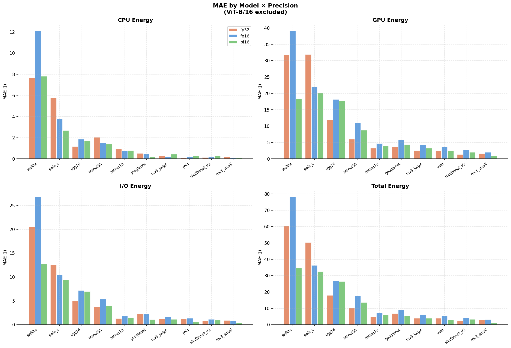

**fp16 is the hardest precision to predict across all targets and nearly all models.** This is a consistent and strong pattern:

| Target | Easiest precision | Hardest precision |
|---|---|---|
| CPU | bf16 (most models) | fp32 (transformers) |
| GPU | fp32 or bf16 | **fp16** (almost universal) |
| I/O | bf16 | **fp16** |
| Total | bf16 | **fp16** |

Selected cases illustrating the fp16 difficulty:

| Model | Target | bf16 MAE | fp16 MAE | fp32 MAE |
|---|---|---|---|---|
| ssdlite | GPU | 18.3 J | **39.1 J** | 31.8 J |
| swin_t | GPU | 20.1 J | **22.0 J** | 31.9 J |
| resnet50 | GPU | 8.7 J | **11.0 J** | 6.0 J |
| ssdlite | I/O | 12.7 J | **26.8 J** | 20.5 J |
| vit_b_16 | GPU | 8.9 J | **76.0 J** | — |

This aligns with the earlier data analysis finding: fp16 produces counter-intuitive energy values for some models (e.g., worse than fp32 for small depthwise models), making it harder to generalise. The predictor learns a relationship between precision and energy that does not hold uniformly across all models.

For **transformers (Swin-T, ViT)**, fp32 is additionally hard to predict for CPU energy — consistent with the large fp32 penalty observed in the training data.

---

## 7. Worst Configurations

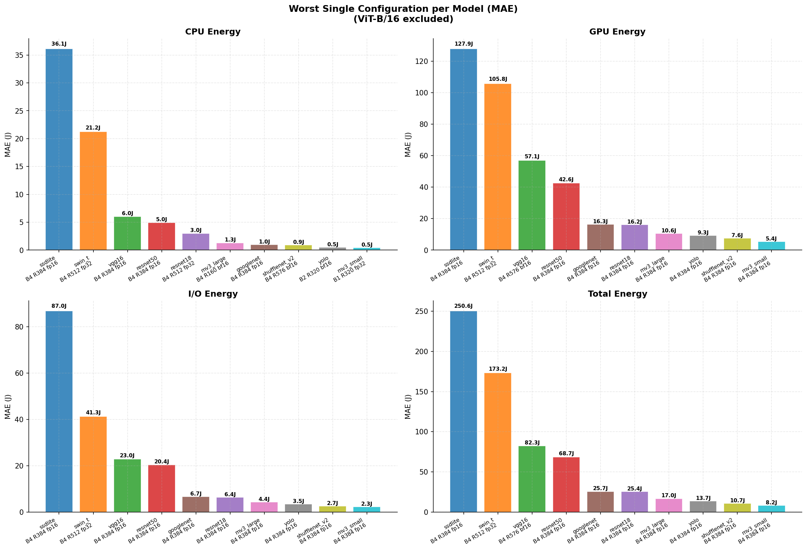

| Model | CPU worst | GPU worst | I/O worst | Total worst |
|---|---|---|---|---|
| ssdlite | B4 R384 fp16 (36J) | B4 R384 fp16 (128J) | B4 R384 fp16 (87J) | B4 R384 fp16 (251J) |
| swin_t | B4 R512 fp32 (21J) | B4 R512 fp32 (106J) | B4 R512 fp32 (41J) | B4 R512 fp32 (173J) |
| vgg16 | B4 R384 fp16 (6J) | B4 R576 bf16 (57J) | B4 R384 fp16 (23J) | B4 R576 bf16 (82J) |
| resnet50 | B4 R384 fp16 (5J) | B4 R384 fp16 (43J) | B4 R384 fp16 (20J) | B4 R384 fp16 (69J) |
| resnet18 | B4 R512 fp32 (3J) | B4 R384 fp16 (16J) | B4 R384 fp16 (6J) | B4 R384 fp16 (25J) |

**The combination batch=4 + resolution=384 + fp16 is the worst configuration for GPU, I/O, and total energy across almost every model.** This is a structural problem: resolution=384 is underrepresented in the holdout (1 sample per model after splitting), and fp16 at high batch is already the hardest precision to predict. Their coincidence creates a systematic failure point.

For CPU energy the pattern is slightly different — resolution=512 and fp32 also appear — but batch=4 remains a constant across all worst configs.

---

## 8. Over- and Under-prediction

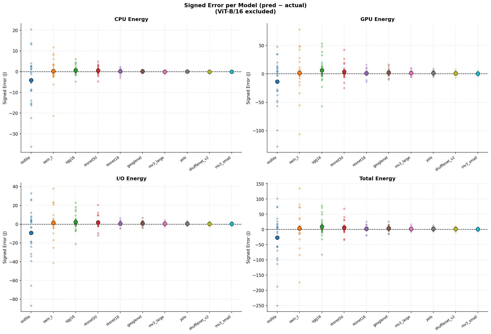

- **SSDLite is systematically underestimated** across all targets. The predictor consistently predicts less energy than is actually consumed, especially at batch=4. This is the clearest systematic bias in the entire predictor suite.
- **Swin-T shows mixed bias** — underestimation at low batch, overestimation at high batch — suggesting the predictor captures the direction of batch scaling but not its magnitude.
- **Lightweight models (MobileNet, ShuffleNet, YOLO)** are centred near zero for all targets — no systematic bias, confirming reliable predictions.
- **GPU and Total energy show wider signed error spread** than CPU and I/O, consistent with their larger absolute scale and higher variance.

---

## 9. Summary

| Finding | Targets affected | Implication |
|---|---|---|
| Flat models (MobileNet, ShuffleNet, YOLO) predict reliably across all targets | All | Predictor is trustworthy in its reliable operating region |
| GPU energy is the hardest target (MAPE 9.2%) | GPU | More complex interactions; GPU compute patterns are harder to learn statically |
| SSDLite is consistently underestimated, especially at batch=4 | All | Near-linear batch scaling not captured; consider batch-specific calibration |
| ViT-B/16 has only 3 test samples — results are not statistically meaningful | All | Excluded from plots; more benchmark data at varied resolutions required |
| fp16 is the hardest precision to predict for GPU and I/O | GPU, I/O, Total | fp16 produces non-monotonic energy values; precision must be modelled per-model |
| Resolution=384 produces +150% to +380% above-average MAE for all models | All | Single holdout sample at res=384 — data sparsity artefact, not a structural predictor failure |
| Batch=4 + resolution=384 + fp16 is a universal failure point | GPU, I/O, Total | Data sparsity at res=384 + fp16 difficulty compound; more training data needed |
| Total energy error ≈ sum of component errors (errors mostly additive) | Total | No benefit from predicting total directly vs summing component predictions |
