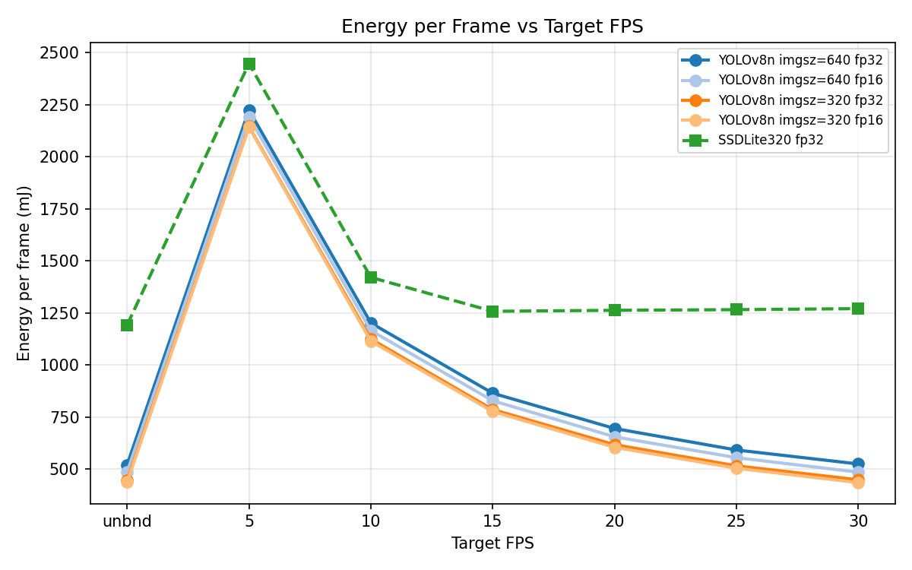
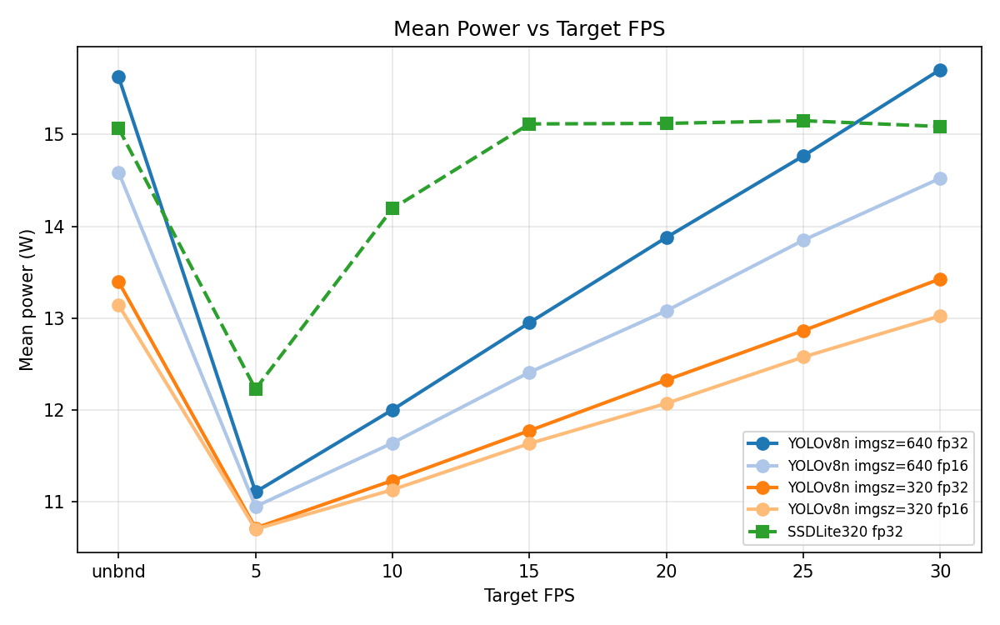
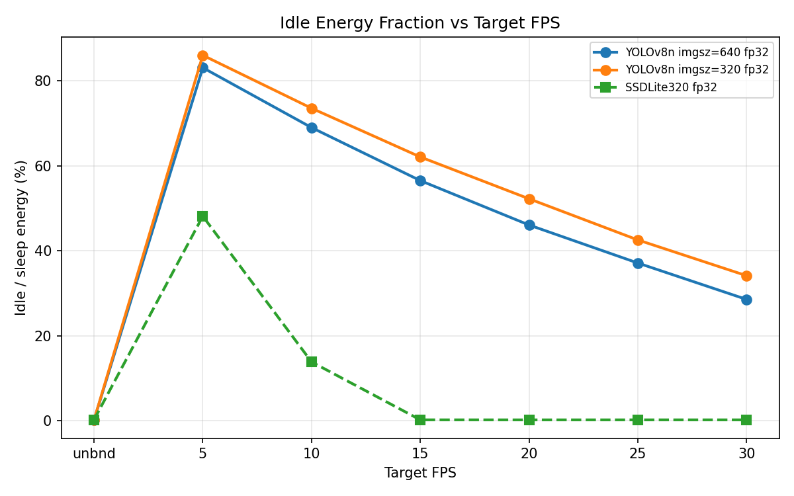
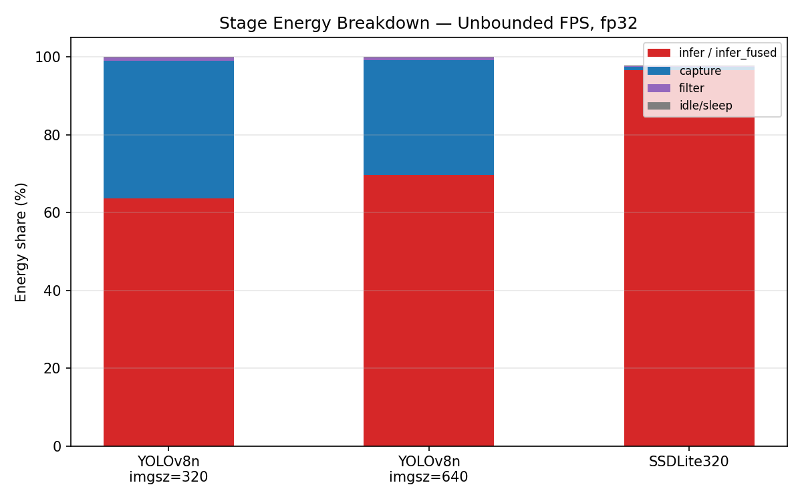
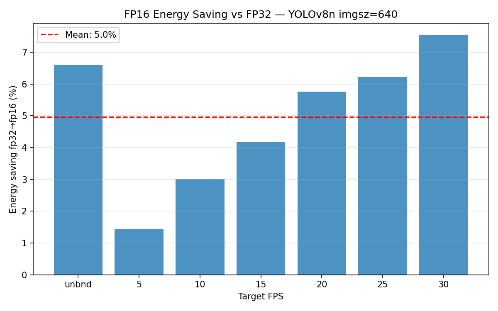

# Sweep Analysis — Camera Benchmark Results

**Platform:** Jetson AGX Orin Developer Kit  
**Power mode:** MAXN (`sudo nvpmodel -m 0`) with clocks locked (`sudo jetson_clocks`)  
**Power measurement:** INA3221 — CPU + GPU + IO rails at 1 kHz  
**Camera:** Logitech USB webcam, 640×480  
**Benchmark window:** 60 s timed, 30-frame warmup discarded  
**Repeats per config:** 3 (all values averaged)

---

## Datasets

| Sweep | Model | imgsz | Precision | FPS targets | Runs |
|---|---|---|---|---|---|
| `yolov8n_fps_sweep_MAXN_20260428_133405` | YOLOv8n | 640 | fp32 + fp16 | 0, 5, 10, 15, 20, 25, 30 | 42 |
| `yolov8n_fps_sweep_MAXN_20260428_150803` | YOLOv8n | 320 | fp32 + fp16 | 0, 5, 10, 15, 20, 25, 30 | 42 |
| `ssdlite_fps_sweep_MAXN_20260428_162918` | SSDLite320-MobileNetV3 | 320 (fixed) | fp32 | 0, 5, 10, 15, 20, 25, 30 | 21 |

All 105 runs completed successfully with full energy attribution.

---

## 1. Energy per Frame vs Target FPS

**Key observations:**

- All YOLO curves share the same shape: energy/frame drops steeply from 5 FPS to ~20 FPS, then flattens as the pipeline becomes camera-limited.
- At 5 FPS, 83–86% of energy is idle/sleep — the Jetson pays the idle power floor (~11 W) for ~180 ms between every 19 ms inference. Running at 30 FPS delivers 6× more detections for only ~40% more total energy.
- imgsz=320 saves ~14% energy per frame vs imgsz=640 across all FPS targets, at identical throughput. Both hit the camera-limited ceiling of ~30 FPS.
- SSDLite is compute-bound at ~12 FPS. FPS targets ≥15 all converge to the same operating point (≈1260 mJ/frame, ≈97% infer, ≈0.2% idle) — throttling has no effect above the natural ceiling.

---

## 2. Mean Power vs Target FPS

The operating power range is narrow across all configurations:

| Config | Min power (5 FPS) | Max power (unbounded) | Range |
|---|---|---|---|
| YOLOv8n imgsz=640 fp32 | 11.1 W | 15.6 W | 4.5 W |
| YOLOv8n imgsz=320 fp32 | 10.7 W | 13.4 W | 2.7 W |
| SSDLite320 fp32 | 12.2 W | 15.1 W | 2.9 W |

The idle power floor is ~10–11 W (never lower regardless of FPS). Active inference adds only ~3–5 W on top. This narrow range is why FPS pacing is an inefficient energy-saving strategy — you save total energy by sleeping, but waste it per detection.

---

## 3. Idle Energy Fraction vs Target FPS

Idle fraction is a clean, monotonic function of FPS for YOLO — exactly the structure needed for a simple regression model. SSDLite's idle collapses to near zero above its ~12 FPS ceiling, confirming the compute-bound regime.

| Target FPS | Idle% — YOLOv8n 640 | Idle% — YOLOv8n 320 | Idle% — SSDLite |
|---|---|---|---|
| 5 | 83.1% | 86.1% | 48.1% |
| 10 | 69.0% | 73.6% | 13.8% |
| 15 | 56.5% | 62.1% | 0.2% |
| 20 | 46.1% | 52.3% | 0.2% |
| 25 | 37.1% | 42.6% | 0.2% |
| 30 | 28.6% | 34.1% | 0.2% |
| unbounded | 0.1% | 0.2% | 0.2% |

---

## 4. Stage Energy Breakdown — Unbounded FPS

| Stage | YOLOv8n imgsz=320 | YOLOv8n imgsz=640 | SSDLite320 |
|---|---|---|---|
| infer / infer_fused | 63.6% | 69.7% | 96.7% |
| capture | 35.3% | 29.5% | 0.8% |
| filter | 0.9% | 0.7% | 0.3% |
| idle/sleep | 0.2% | 0.1% | 0.2% |

**YOLOv8n at unbounded FPS is camera-limited**: inference finishes in ~10–19 ms depending on imgsz, then the pipeline blocks on `cap.read()` waiting for the next frame (~14 ms). Capture's share grows as imgsz decreases because inference finishes faster, amplifying the camera wait.

**SSDLite is compute-bound**: 96.7% of energy goes to the GPU forward pass, leaving virtually no idle headroom. The model takes ~79 ms per inference — longer than a 30 FPS frame period — so it runs at its natural ~12 FPS ceiling regardless of the FPS target.

---

## 5. FP16 Energy Saving vs FP32

FP16 consistently saves **6–7% energy** across all FPS targets for YOLOv8n imgsz=640, with **no latency benefit** (33.2 ms in both cases). The saving comes from lower GPU power draw, not faster computation — at batch=1, the GPU Tensor Cores are not tile-saturated at either precision.

| Precision | Power (unbounded) | mJ/frame | Latency |
|---|---|---|---|
| fp32 | 15.6 W | 520 mJ | 33.2 ms |
| fp16 | 14.6 W | 486 mJ | 33.2 ms |
| **Saving** | **6.6%** | **6.6%** | **0%** |

---

## 6. Summary Table — All Configurations (fp32, averaged over 3 repeats)

| Model | imgsz | Target FPS | Actual FPS | Power (W) | Total J | mJ/frame | infer% | idle% |
|---|---|---|---|---|---|---|---|---|
| YOLOv8n | 640 | unbounded | 30.2 | 15.6 | 938 | 520 | 69.7% | 0.1% |
| YOLOv8n | 640 | 30 | 29.9 | 15.7 | 943 | 525 | 69.2% | 28.6% |
| YOLOv8n | 640 | 15 | 15.0 | 12.9 | 778 | 864 | 42.1% | 56.5% |
| YOLOv8n | 640 | 5 | 5.0 | 11.1 | 667 | 2224 | 16.4% | 83.1% |
| YOLOv8n | 320 | unbounded | 30.2 | 13.4 | 804 | 446 | 63.6% | 0.2% |
| YOLOv8n | 320 | 30 | 29.9 | 13.4 | 806 | 449 | 63.5% | 34.1% |
| YOLOv8n | 320 | 15 | 15.0 | 11.8 | 707 | 786 | 36.6% | 62.1% |
| YOLOv8n | 320 | 5 | 5.0 | 10.7 | 644 | 2145 | 13.4% | 86.1% |
| SSDLite320 | 320 | unbounded | 12.7 | 15.1 | 905 | 1191 | 96.7% | 0.2% |
| SSDLite320 | 320 | 15 | 12.0 | 15.1 | 907 | 1258 | 97.0% | 0.2% |
| SSDLite320 | 320 | 10 | 10.0 | 14.2 | 852 | 1420 | 83.9% | 13.8% |
| SSDLite320 | 320 | 5 | 5.0 | 12.2 | 734 | 2447 | 50.5% | 48.1% |

---

## 7. Key Findings

1. **FPS is the dominant control variable for YOLO energy efficiency.** Going from 5 to 30 FPS costs only ~40% more total energy but delivers 6× more detections. The idle power floor (~11 W) makes low frame rates expensive per detection.

2. **Inference resolution (imgsz) shifts the power level without changing throughput.** At unbounded FPS, imgsz=320 saves 14% energy per frame vs imgsz=640 with identical FPS (~30), because both are camera-limited. The saving is purely from lower GPU draw.

3. **FP16 saves ~7% energy with no latency benefit.** At batch=1, Tensor Core tiles are not fully utilised at either precision. The saving is real but modest.

4. **SSDLite is compute-bound above ~12 FPS.** Its MobileNetV3 backbone, designed for mobile CPU inference, maps poorly to CUDA Tensor Cores. YOLOv8n is 2.4× faster and delivers lower energy per frame across all tested operating points.

5. **Idle fraction is a clean, monotonic, model-agnostic function of (fps_target / fps_max).** This regularity makes it tractable to model with a simple regression.
