# Sweep Parameters — Effect on Energy & Power
> **Dataset:** `data/training_data/filtred_data.csv` — 909 rows, 11 models, all CUDA/eager
> **Date:** 2026-03-27

---

## 0. Preliminaries

### 0.1 How Energy is Measured

The benchmarking loop works as follows:

```
warmup: 30 forward passes   ← discarded, not measured
timed:  200 forward passes  ← t0 to t1, power sampled continuously

energy_X_J = integrate(power_X, t0, t1)   ← total energy over 200 iters
latency_ms  = (t1 - t0) / 200             ← per-forward-pass average
```

**All energy values in this dataset (`energy_cpu_J`, `energy_gpu_J`, `energy_io_J`) are the total energy consumed over 200 forward passes — not per image, not per forward pass.**

To convert to a per-forward-pass figure, divide by `iters = 200`. To get per-image energy, divide by `iters × batch`.

| Want | Formula |
|---|---|
| Energy per forward pass | `energy_X_J / 200` |
| Energy per image | `energy_X_J / (200 × batch)` |

This distinction matters when comparing across batch sizes: a model showing 85 J at batch=1 and 153 J at batch=2 is not "twice as expensive" per image — per image it actually got slightly cheaper.

---

### 0.2 How Models Handle Input Resolution

A key finding from inspecting the model source code: **not all models actually process the resolution you pass them.**

| Model | Resolution behaviour | Mechanism |
|---|---|---|
| ResNet18/50 | Processes input as-is | `AdaptiveAvgPool2d((1,1))` collapses any H×W before FC |
| MobileNetV3 L/S | Processes input as-is | `AdaptiveAvgPool2d(1)` |
| GoogLeNet | Processes input as-is | `AdaptiveAvgPool2d((1,1))` |
| ShuffleNet V2 | Processes input as-is | `x.mean([2,3])` global average pool |
| VGG16 | Processes input as-is | `AdaptiveAvgPool2d((7,7))` before FC |
| Swin-T | Processes input as-is | Pads to nearest window-size multiple internally |
| **ViT-B/16** | **Hard-fails on anything ≠ 224px** | `torch._assert(h == 224)` in `forward()` — fixed positional embeddings |
| **SSDLite** | **Always resizes to 320×320** | `GeneralizedRCNNTransform(fixed_size=(320,320))` is the first op in `forward()` |
| YOLO | Processes input as-is (direct model call) | No internal resize when calling `model.model(tensor)` directly |

**Implications:**
- **ViT-B/16** has only 9 rows in the dataset (only 224px succeeded) — the resolution sweep is effectively absent for this model.
- **SSDLite** always runs at 320×320 internally regardless of what resolution is passed. Its `macs_total` is therefore **identical across all resolution configurations** (730,157,976 MACs for batch=1 at every resolution). The resolution sweep has zero computational effect on SSDLite — it only affects the silent preprocessing step, not the backbone.

These two models must be treated as special cases throughout the analysis.

---

### 0.3 Metrics Defined

All four metrics are measured over the 200-iteration timed window:

| Metric | Unit | What it measures |
|---|---|---|
| `energy_cpu_J` | Joules | Total CPU-side energy over 200 iters (host ops, framework, data movement) |
| `energy_gpu_J` | Joules | Total GPU energy over 200 iters (kernels, memory transfers) |
| `energy_io_J` | Joules | Total I/O energy over 200 iters (storage, peripheral bus) |
| `power_total_W` | Watts | Mean total system power draw during the run |

> **Note:** `energy ≈ power × time`. A model can have high energy with low power (runs long), or high power with low energy (runs fast). These two axes are independent and both matter for edge deployment.

---

## 1. Per-Model Overview

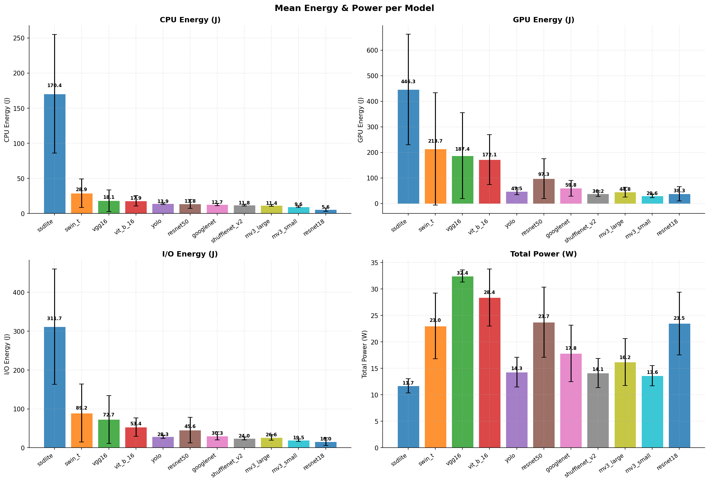

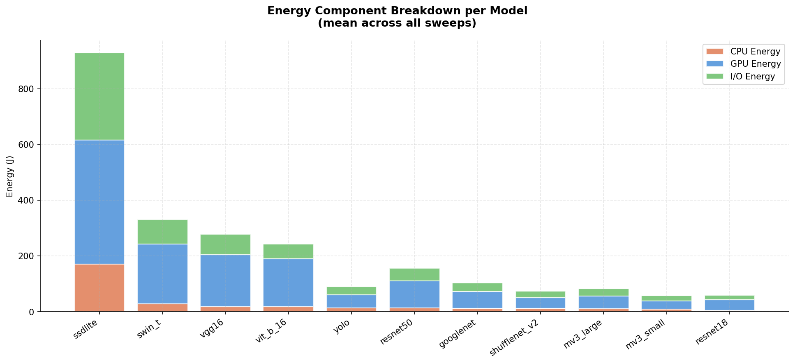

### 1.1 Energy Rankings (mean across all sweeps)

| Model | CPU (J) | GPU (J) | I/O (J) | Total (J) | Power (W) |
|---|---|---|---|---|---|
| ssdlite | 170.40 | 446.28 | 311.72 | **928.4** | 11.68 |
| swin_t | 28.88 | 213.75 | 89.25 | 331.9 | 23.02 |
| vgg16 | 18.12 | 187.40 | 72.66 | 278.2 | 32.44 |
| vit_b_16 | 17.94 | 172.07 | 53.38 | 243.4 | 28.38 |
| resnet50 | 13.78 | 97.35 | 45.56 | 156.7 | 23.72 |
| googlenet | 12.71 | 59.79 | 30.35 | 102.8 | 17.83 |
| yolo | 13.86 | 47.50 | 28.34 | 89.7 | 14.29 |
| mobilenet_v3_large | 11.42 | 44.77 | 26.60 | 82.8 | 16.19 |
| shufflenet_v2_x1_0 | 11.76 | 38.22 | 23.96 | 73.9 | 14.11 |
| mobilenet_v3_small | 9.57 | 29.59 | 19.47 | 58.6 | 13.62 |
| resnet18 | 5.59 | 38.32 | 15.97 | 59.9 | 23.47 |

### 1.2 Energy Component Proportions (CPU / GPU / I/O)

| Model | CPU % | GPU % | I/O % |
|---|---|---|---|
| vgg16 | 6.5% | **67.4%** | 26.1% |
| vit_b_16 | 7.4% | **70.7%** | 21.9% |
| resnet18 | 9.3% | **64.0%** | 26.7% |
| swin_t | 8.7% | **64.4%** | 26.9% |
| resnet50 | 8.8% | **62.1%** | 29.1% |
| googlenet | 12.4% | **58.1%** | 29.5% |
| yolo | 15.5% | 53.0% | 31.6% |
| mobilenet_v3_large | 13.8% | 54.1% | 32.1% |
| shufflenet_v2_x1_0 | 15.9% | 51.7% | 32.4% |
| mobilenet_v3_small | 16.3% | 50.5% | 33.2% |
| ssdlite | 18.4% | 48.1% | **33.6%** |

**Notable patterns:**
- **GPU dominates in all models** (50–71% of total energy) — the GPU is always the primary energy sink on CUDA.
- **ViT-B/16 and VGG16 have the highest GPU share** (70.7% and 67.4%) — dense matrix ops (large FC layers in VGG, global attention in ViT) are highly GPU-bound.
- **Efficient models (MobileNet, ShuffleNet, SSDLite) have the highest I/O and CPU shares** — their GPU kernels are smaller and faster, so the relative cost of data movement and host overhead is larger.
- **SSDLite has the highest CPU share (18.4%)** — post-processing steps like NMS run on the CPU, adding overhead that pure classifiers don't have.
- **I/O energy is never negligible** — it ranges from 22% to 34% of total energy across all models. This is often ignored in theoretical analysis but is clearly significant in practice.

---

## 2. Effect of Batch Size

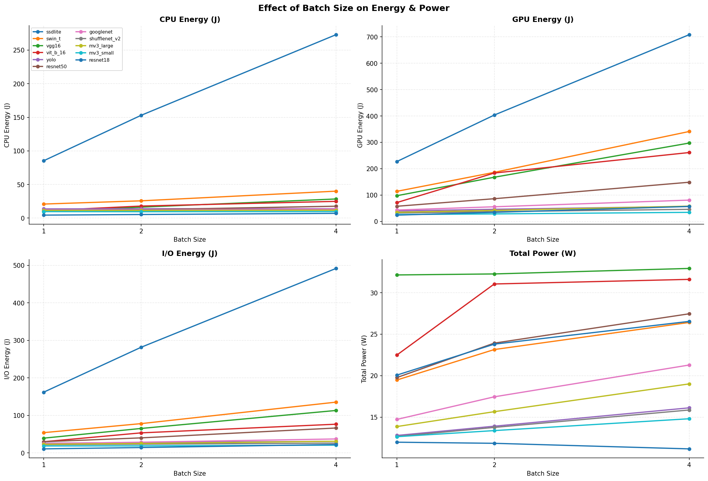

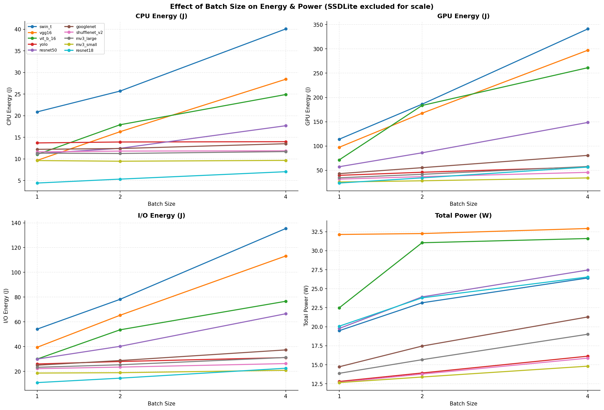

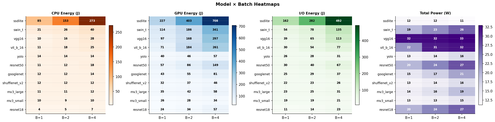

> **Note:** Averaging batch effects across models is misleading — models fall into fundamentally different scaling regimes. The per-model breakdown below is the only meaningful unit of analysis.

### 2.1 Per-Model Batch Behaviour

| Model | CPU B=1 | CPU B=2 | CPU B=4 | Scaling |
|---|---|---|---|---|
| ssdlite | 85.30 | 152.93 | 272.98 | Near-linear (~×3.2) |
| vgg16 | 9.65 | 16.29 | 28.43 | Near-linear (~×2.9) |
| swin_t | 20.88 | 25.69 | 40.07 | Sub-linear (~×1.9) |
| vit_b_16 | 11.03 | 17.90 | 24.89 | Sub-linear (~×2.3) |
| resnet50 | 11.23 | 12.44 | 17.67 | Sub-linear (~×1.6) |
| resnet18 | 4.41 | 5.32 | 7.03 | Sub-linear (~×1.6) |
| googlenet | 12.21 | 12.40 | 13.51 | Near-flat |
| yolo | 13.69 | 13.91 | 13.98 | **Flat** |
| mobilenet_v3_large | 11.33 | 11.25 | 11.69 | **Flat** |
| mobilenet_v3_small | 9.61 | 9.46 | 9.65 | **Flat** |
| shufflenet_v2_x1_0 | 11.62 | 11.80 | 11.86 | **Flat** |

**Three distinct scaling patterns emerge, likely related to different baseline utilisation/overhead regimes at batch=1.** A useful diagnostic is the throughput gain when going from B=1 to B=4 (FPS ratio): a ratio near ×4.0 suggests strong amortisation of fixed costs; a ratio near ×1.0 suggests little batching benefit in this setup.

| Model | Latency B=1 (ms) | Latency B=4 (ms) | Latency ratio | Throughput gain (FPS×) |
|---|---|---|---|---|
| ssdlite | 197.7 | 658.8 | ×3.33 | ×1.20 |
| vgg16 | 22.5 | 65.6 | ×2.91 | ×1.77 |
| swin_t | 47.2 | 91.0 | ×1.93 | ×2.87 |
| resnet50 | 24.9 | 39.6 | ×1.59 | ×3.07 |
| resnet18 | 9.8 | 15.3 | ×1.57 | ×3.01 |
| mobilenet_v3_large | 25.0 | 26.3 | ×1.05 | ×3.83 |
| shufflenet_v2_x1_0 | 25.9 | 26.6 | ×1.03 | ×3.91 |
| yolo | 31.0 | 31.7 | ×1.02 | ×3.91 |

---

**1. Flat responders (YOLO, MobileNet, ShuffleNet):** CPU energy is batch-invariant because latency is batch-invariant (×1.02–1.05). These models achieve near-perfect throughput scaling (×3.8–3.9, approaching the ×4.0 theoretical maximum). A plausible interpretation is that fixed overheads (kernel launch/dispatch/synchronisation and framework runtime costs) are a large share of runtime at these settings, while added per-image compute from B=1→4 is relatively cheap. This pattern is consistent with low effective utilisation at B=1, but confirming that mechanism would require profiler evidence (e.g., SM activity and enqueue vs compute time). Since wall time barely changes with batch, CPU energy (≈ power × time) stays flat. **Implication for the predictor: batch size appears to be a weak feature for these models in this benchmark range.**

**2. Sub-linear scalers (ResNet18/50, Swin-T, ViT):** CPU energy grows with batch but less than proportionally (×1.6–1.9). Throughput improves substantially (×2.9–3.1), which is consistent with batching amortising fixed overhead and improving hardware efficiency relative to B=1. A likely explanation is improved parallel work scheduling/occupancy as batch increases. The gains are meaningful but not ideal-×4, indicating remaining bottlenecks (compute, memory, or runtime overhead) at B=4.

**3. Near-linear scalers (SSDLite, VGG16):** CPU energy grows nearly proportionally with batch, but likely for different reasons — these two models should not be conflated.

- **SSDLite (throughput gain ×1.20, latency ratio ×3.33):** The near-zero throughput gain and super-linear latency scaling (>×3 for B×4) indicate substantial non-batched overhead in this end-to-end detection path. A more defensible interpretation is that per-image postprocessing/runtime overhead (including detection postprocess steps and framework-level Python/control-flow costs) grows with batch and limits throughput scaling. NMS may contribute, but from this dataset alone we cannot attribute the effect to NMS alone or to CPU-only execution.

- **VGG16 (throughput gain ×1.77, latency ratio ×2.91):** Throughput improves with batch (×1.77), so B=1 is likely not fully optimal. The gain is still modest compared with ResNet (×3.07). One plausible explanation is that VGG16 already maps relatively efficiently to GPU kernels at B=1 (dense conv blocks), leaving less incremental benefit from larger batches than models with more launch/overhead-dominated behavior. This is an interpretation, not a direct occupancy measurement.

---

### 2.2 Batch Effect on GPU Energy, I/O Energy, and Power

To complete the batch story, we also check how the other channels change from B=1 to B=4.  
The table below reports the ratio `metric(B=4) / metric(B=1)` per model.

| Model | GPU energy × (B4/B1) | I/O energy × (B4/B1) | Power × (B4/B1) |
|---|---:|---:|---:|
| ssdlite | 3.12 | 3.04 | 0.93 |
| vgg16 | 3.05 | 2.87 | 1.02 |
| swin_t | 2.99 | 2.50 | 1.36 |
| vit_b_16 | 3.66 | 2.56 | 1.41 |
| resnet50 | 2.59 | 2.22 | 1.39 |
| resnet18 | 2.38 | 2.07 | 1.32 |
| googlenet | 1.87 | 1.49 | 1.44 |
| mobilenet_v3_large | 1.67 | 1.34 | 1.37 |
| yolo | 1.43 | 1.20 | 1.26 |
| shufflenet_v2_x1_0 | 1.43 | 1.18 | 1.25 |
| mobilenet_v3_small | 1.32 | 1.12 | 1.17 |

**What this adds to the interpretation:**
- **GPU and I/O energy usually rise with batch**, even when CPU energy is almost flat. This means extra work is still happening; it is just hidden by overhead amortisation in latency/CPU energy.
- **Power grows less than energy in most models** (typically +17% to +44%), while energy often grows much more. This matches `energy ≈ power × time`: runtime growth is the bigger driver.
- **VGG16 is a clear high-power plateau case** (`~×1.02` power): it already runs near its high power state at B=1, so higher batch mainly extends time.
- **SSDLite is unusual:** GPU and I/O energy increase strongly, but mean power slightly decreases (`0.93×`). This is consistent with much longer runtimes and more time spent in lower-power phases, not with lower total work.

---

## 3. Effect of Resolution

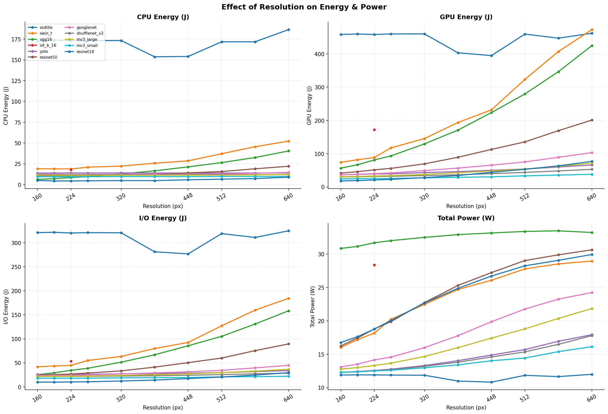

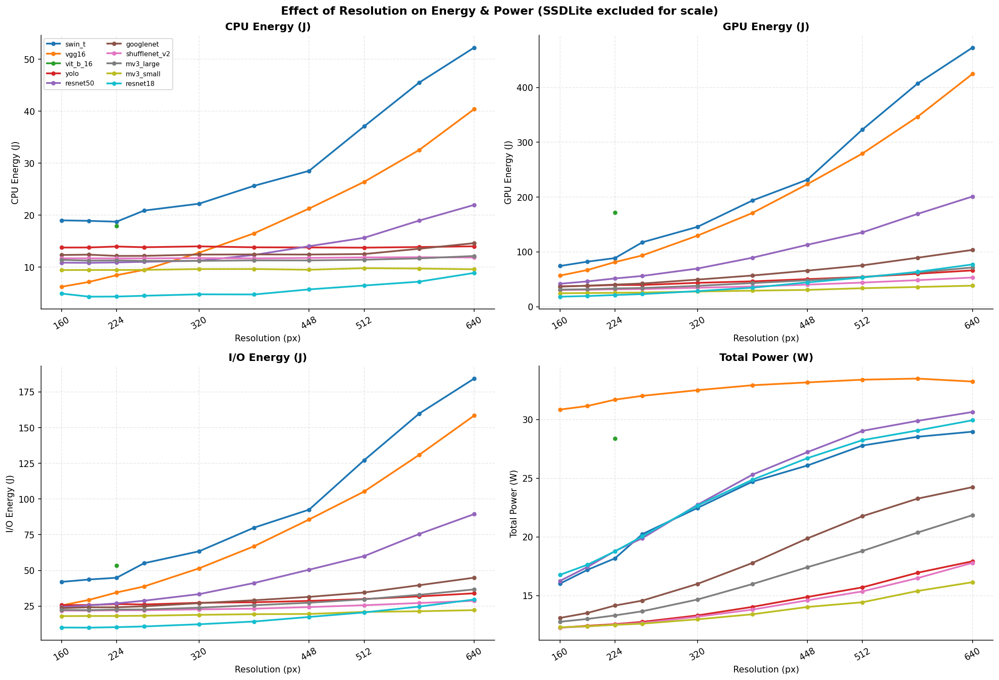

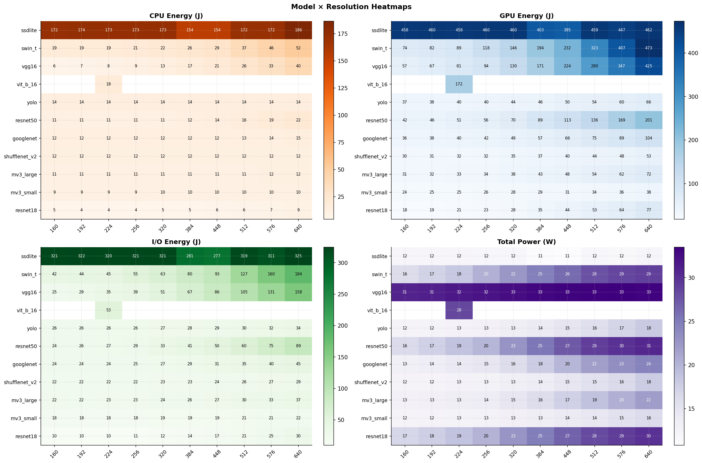

### 3.1 Correlations with Resolution

> **Caveat:** These correlations are computed across all models pooled together. Since models differ structurally, the numbers reflect a global trend but mask per-model behaviour — use the heatmap and per-model plots (fig06/07/10) for the real story.

| Metric | Pearson r |
|---|---|
| `power_total_W` | **+0.343** |
| `energy_gpu_J` | **+0.218** |
| `energy_io_J` | +0.130 |
| `energy_cpu_J` | +0.054 |

Resolution has the **strongest effect on power** and **GPU energy**, a moderate effect on I/O energy, and is nearly uncorrelated with CPU energy globally. The per-model picture (section 4.2) explains why:

- **GPU energy** tracks input size because larger feature maps → more kernel operations → more GPU work.
- **Power** increases with resolution because the GPU sustains higher utilisation when processing larger tensors.
- **CPU energy** is dominated by framework overhead and latency — since latency also grows with resolution, these effects partially cancel out.
- **I/O energy** increases moderately — larger inputs mean more data transferred through the memory hierarchy.

### 3.2 Model-Level Resolution Sensitivity

The heatmap (fig10) reveals stark differences:

- **SSDLite is resolution-insensitive for all energy metrics** — its energy is flat regardless of the input resolution you pass. The reason is architectural: `ssdlite320_mobilenet_v3_large` internally applies a `GeneralizedRCNNTransform` with `fixed_size=(320, 320)` as the very first step of its `forward()`. Every input — whether 160px or 640px — is silently warped to 320×320 before the backbone sees it. The resolution sweep therefore has zero effect on its actual computation. **Implication for the predictor: resolution is a useless feature for SSDLite.**
- **Swin-T and ResNet50 show clear resolution growth** — their energy climbs steadily with resolution, as expected for dense convolutional models.
- **ViT-B/16** only has data at 224 (single column in the heatmap) — no resolution effect can be measured. This is also architectural: ViT raises a hard assertion error (`torch._assert`) for any resolution other than exactly 224×224, so all non-224 configurations failed during benchmarking.
- **MobileNet/ShuffleNet** show mild growth, consistent with their efficient depthwise operations limiting the per-pixel cost.

---

## 4. Effect of Precision (fp32 / fp16 / bf16)

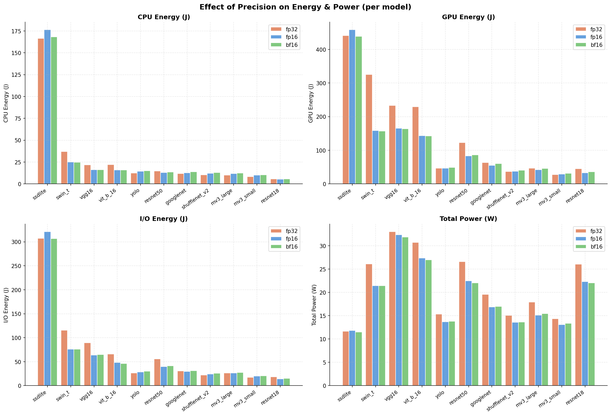

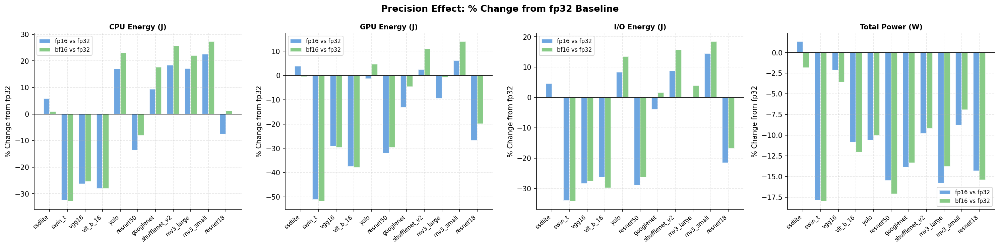

> **Note:** Precision effects are highly model-dependent — aggregating across models produces a meaningless average. The per-model breakdown below is the only valid analysis.

### 4.1 Precision Effect by Model

The precision effect is **strongly model-dependent**.  
Transformers show the largest and most consistent gains, but the effect is **not transformer-only**: some heavier CNNs (e.g., ResNet50, VGG16) also show substantial reductions, while several lightweight/depthwise models show weak gains or regressions.

**Transformers (Swin-T, ViT-B/16)** — very large gains from reduced precision:

| Model | Metric | fp32 | fp16 | bf16 | Reduction |
|---|---|---|---|---|---|
| swin_t | GPU energy | 325.51 J | 158.96 J | 156.78 J | **−52%** |
| vit_b_16 | GPU energy | 229.85 J | 143.66 J | 142.71 J | **−38%** |
| swin_t | CPU energy | 36.92 J | 24.94 J | 24.79 J | −33% |
| vit_b_16 | CPU energy | 22.06 J | 15.88 J | 15.87 J | −28% |

Transformers often benefit most because their dominant operations (large batched matrix multiplications in attention/MLP blocks) are typically well-matched to Tensor Core acceleration in fp16/bf16.  
However, reduced precision also helps some CNNs significantly (for example, ResNet50 and VGG16 show strong total-energy gains), so the practical rule is to tune precision per model rather than by architecture label alone.

**Lightweight CNNs (MobileNet, YOLO, ShuffleNet)** — weak or even **reversed** gains:

| Model | fp32 CPU | fp16 CPU | Note |
|---|---|---|---|
| mobilenet_v3_small | 8.21 J | 10.05 J | fp16 is *more* expensive |
| yolo | 12.23 J | 14.31 J | fp16 is *more* expensive |

For small models with depthwise-separable-heavy workloads, the kernels can be memory/overhead-sensitive enough that reduced precision does not always help. In this regime, effects such as kernel selection, cast overhead, launch/runtime overhead, and memory behavior can outweigh theoretical fp16 speedups, leading to flat or even negative gains.

#### 4.1.1 Precision Gains Across All Models (All Energy Channels)

> Gain definition: `gain(%) = (fp32 - fpX) / fp32 × 100`.  
> Positive values mean reduced energy vs fp32; negative values mean increased energy.

| Model | Type | CPU fp16 gain | GPU fp16 gain | I/O fp16 gain | Total fp16 gain | CPU bf16 gain | GPU bf16 gain | I/O bf16 gain | Total bf16 gain |
|---|---|---:|---:|---:|---:|---:|---:|---:|---:|
| swin_t | Transformer | 32.44% | 51.17% | 33.99% | 45.57% | 32.85% | 51.84% | 34.23% | 46.11% |
| vit_b_16 | Transformer | 28.02% | 37.50% | 26.29% | 34.52% | 28.05% | 37.91% | 29.86% | 35.56% |
| resnet50 | CNN (classification) | 13.57% | 31.97% | 28.91% | 29.67% | 8.15% | 29.66% | 26.30% | 27.03% |
| vgg16 | CNN (classification) | 26.27% | 29.12% | 28.35% | 28.74% | 25.43% | 29.64% | 27.65% | 28.86% |
| resnet18 | CNN (classification) | 7.54% | 26.83% | 21.53% | 23.85% | -1.25% | 19.88% | 16.87% | 17.35% |
| googlenet | CNN (classification) | -9.30% | 13.23% | 3.98% | 8.07% | -17.69% | 4.60% | -1.63% | 0.34% |
| mobilenet_v3_large | CNN (classification, depthwise) | -17.18% | 9.52% | 0.17% | 3.29% | -22.04% | 0.83% | -3.96% | -3.48% |
| yolo | Detector (CNN-like) | -16.98% | 1.39% | -8.32% | -4.23% | -22.99% | -4.71% | -13.49% | -10.03% |
| ssdlite | Detector (CNN-like, depthwise) | -5.89% | -3.89% | -4.63% | -4.50% | -1.01% | 0.56% | 0.15% | 0.14% |
| shufflenet_v2_x1_0 | CNN (classification, lightweight) | -18.35% | -2.45% | -8.86% | -6.87% | -25.70% | -11.06% | -15.71% | -14.73% |
| mobilenet_v3_small | CNN (classification, depthwise) | -22.50% | -6.15% | -14.51% | -11.40% | -27.36% | -14.08% | -18.53% | -17.58% |

---

## 5. Power vs Energy: A Key Distinction

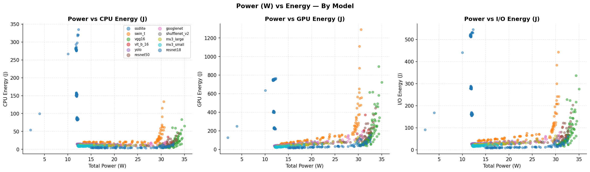

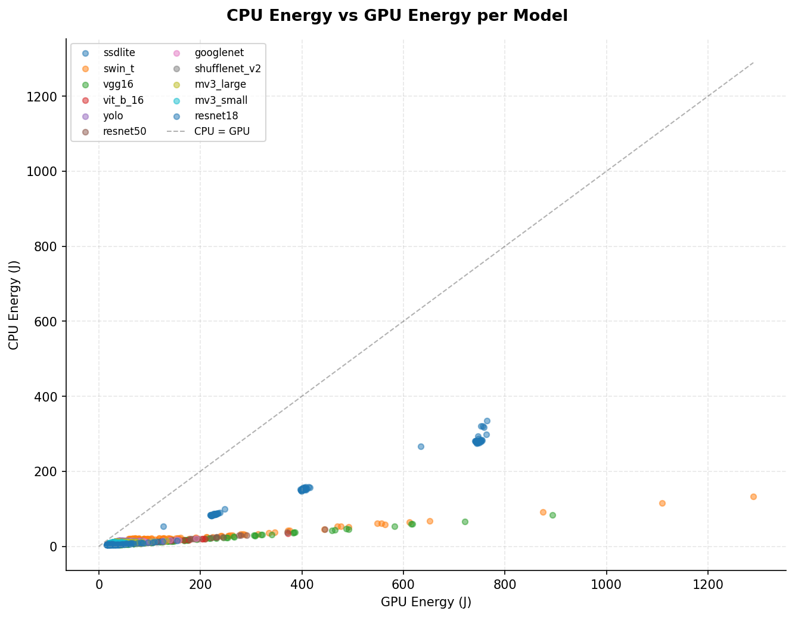

### 5.1 The Power Paradox

| Model | Power (W) | CPU Energy (J) | Interpretation |
|---|---|---|---|
| vgg16 | **32.44** | 18.12 | High power, but fast → moderate energy |
| vit_b_16 | 28.38 | 17.94 | High power, moderate speed |
| resnet18 | 23.47 | 5.59 | High power, very fast → low energy |
| ssdlite | **11.68** | **170.40** | Low power, very slow → highest energy |
| mobilenet_v3_small | 13.62 | 9.57 | Low power, fast → lowest energy |

**SSDLite draws the least power (11.68 W) yet consumes the most CPU energy (170 J)** — because it runs for 403 ms per batch, far longer than any classifier. This is the clearest illustration that **power alone is a poor proxy for energy** and that latency (i.e., run duration) is the dominant factor.

**VGG16 draws the most power (32.44 W) but does not have the highest energy** — it's fast (42 ms latency) so the high instantaneous power is short-lived.

This also explains the **negative correlation between power and CPU energy** (r = −0.220) seen in the dataset: efficient models with short runtimes tend to have higher mean power (because the GPU is fully loaded during that short burst), while slow models like SSDLite sustain lower but prolonged power draw.

### 5.2 GPU vs CPU Energy

From fig12, the relationship between GPU and CPU energy is roughly linear but with clear model-level clusters. GPU energy is consistently 4–8× higher than CPU energy across models, with the ratio being highest for compute-bound models (ViT, VGG) and lower for I/O-heavy ones (SSDLite, MobileNet). All points lie well above the `CPU = GPU` diagonal, confirming that **GPU is always the dominant energy consumer** on CUDA.

---

## 6. Correlation Summary

> **Note:** These correlations are computed across all 909 rows pooled together. They are useful as a global signal but should not be interpreted per-model — a feature that correlates with energy across the full dataset may be irrelevant or even inversely correlated within a specific model's subset.

### Static features vs all metrics

| Feature | CPU r | GPU r | I/O r | Power r |
|---|---|---|---|---|
| `batch` | +0.179 | +0.280 | +0.230 | +0.224 |
| `resolution` | +0.054 | **+0.218** | +0.130 | **+0.343** |
| `macs_total` | +0.007 | **+0.385** | +0.178 | **+0.582** |
| `num_params` | −0.091 | +0.161 | +0.019 | **+0.691** |
| `flops_per_sample` | −0.038 | **+0.293** | +0.110 | **+0.631** |

**Critical insight:** The three energy metrics behave very differently as prediction targets:

- **`energy_cpu_J`** is the hardest to predict from static features — all correlations are near zero. It is dominated by run duration (latency), which depends on model identity in ways that raw FLOPs don't capture.
- **`energy_gpu_J`** has meaningful correlations with MACs (r=0.385) and FLOPs (r=0.293) — GPU execution time is more directly tied to compute budget.
- **`power_total_W`** has the strongest correlations with static features (MACs r=0.582, num_params r=0.691) — instantaneous power is related to model size and complexity in a more direct way.

This suggests that **separate predictors may be needed** for each energy channel, or that feature engineering (e.g., log-MACs, model family flags) is essential to make `energy_cpu_J` predictable from static inputs.

---

## 7. MACs / FLOPs vs Energy

> MACs (Multiply-Accumulate Operations) and FLOPs are the standard theoretical measure of a model's compute budget. Here we test whether they actually predict energy — the answer is nuanced and reveals a fundamental split: **MACs explain energy well within a model, but poorly across models**.

> **Recall:** `flops_total = 2 × macs_total` by convention. The two are interchangeable; we use MACs throughout.

---

### 7.1 Between Models: MACs Do Not Predict CPU Energy

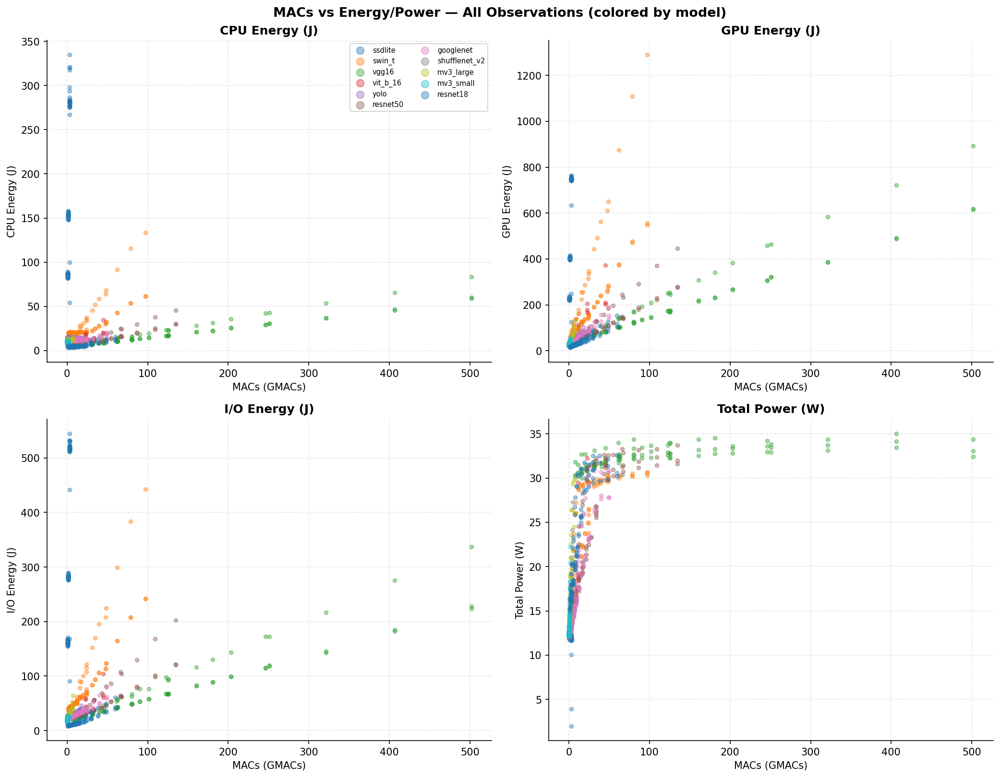

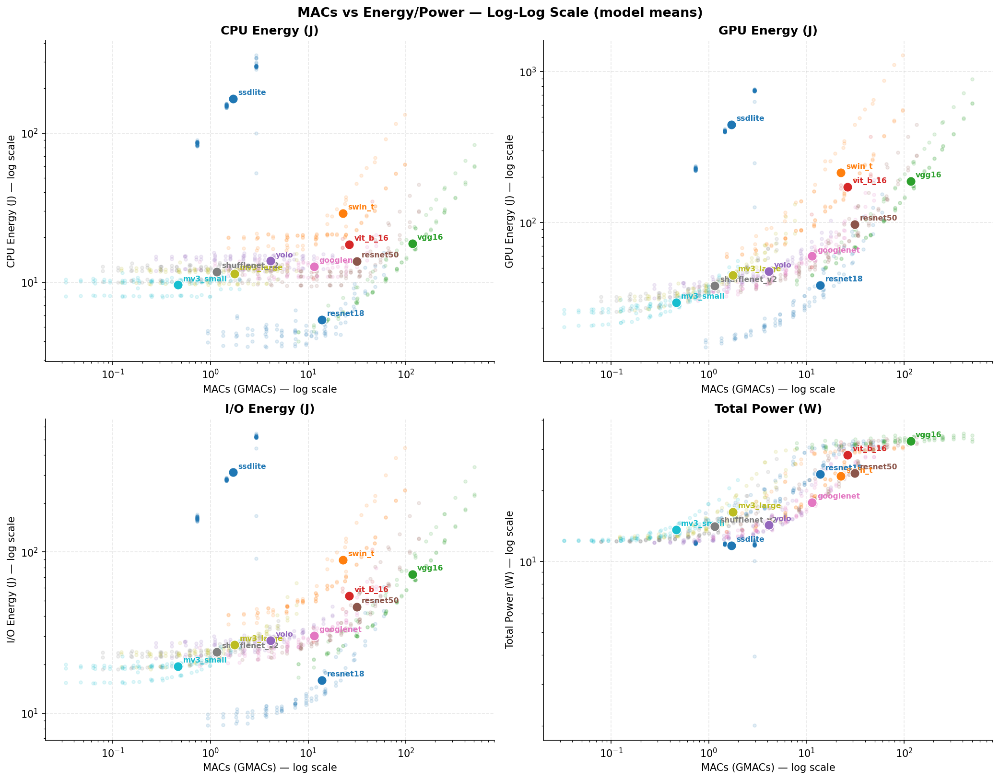

At model-mean level (11 points, one per model):

| Metric | Linear r | Log-log r |
|---|---|---|
| `energy_cpu_J` | **−0.15** | −0.05 |
| `energy_gpu_J` | +0.18 | +0.45 |
| `energy_io_J` | −0.02 | +0.22 |
| `power_total_W` | **+0.82** | **+0.92** |

**CPU energy has a near-zero (even slightly negative) correlation with MACs across models.** GPU energy shows a moderate log-log relationship. Power is the only metric that MACs predict well.

The scatter plots make the problem vivid:

- **SSDLite** has only ~1.7 GMACs (one of the smallest compute budgets) yet has the highest CPU energy (170 J). Its cost comes from post-processing (NMS), not from the convolutions that MACs count.
- **VGG16** has 117 GMACs — 70× more than SSDLite — yet its CPU energy is ~18 J, ten times lower.
- **MobileNet-Small** has 0.46 GMACs and 9.6 J. **ResNet18** has 14 GMACs (30× more) and 5.6 J. More MACs, less CPU energy.

This is the core problem: **MACs count arithmetic operations inside the model. They do not count framework overhead, post-processing, memory latency, or kernel launch costs** — which dominate CPU energy for lightweight and detection models.

---

### 7.2 Within a Model: MACs Predict GPU Energy Very Well

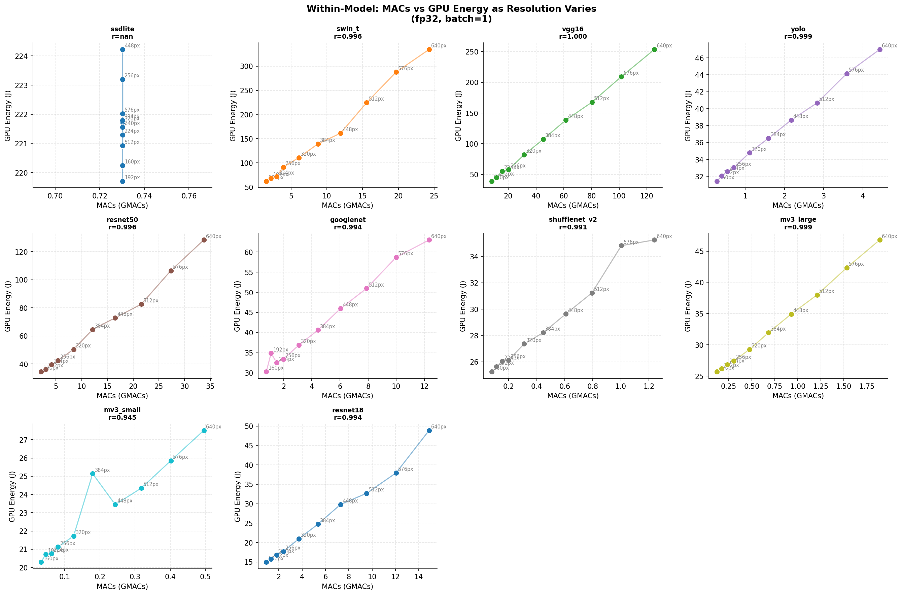

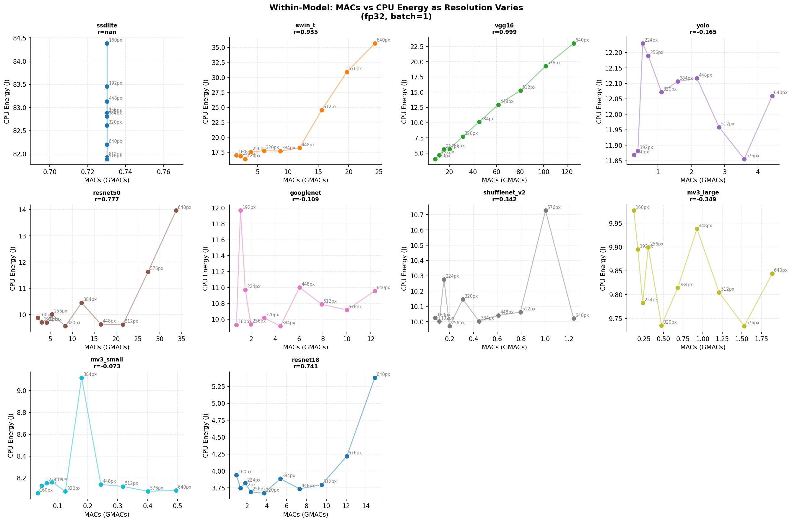

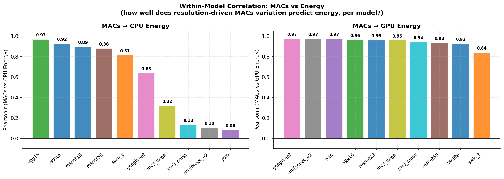

When we fix the model and vary resolution (which directly scales MACs), the picture changes dramatically:

| Model | MACs→GPU r | MACs→CPU r |
|---|---|---|
| vgg16 | **0.961** | **0.967** |
| resnet50 | **0.933** | **0.879** |
| resnet18 | **0.957** | **0.895** |
| swin_t | **0.838** | **0.812** |
| googlenet | **0.973** | 0.635 |
| ssdlite | **0.924** | **0.925** |
| mobilenet_v3_large | **0.956** | 0.317 |
| mobilenet_v3_small | **0.939** | 0.132 |
| shufflenet_v2_x1_0 | **0.972** | 0.105 |
| yolo | **0.971** | 0.083 |

**GPU energy correlates very strongly with MACs within every single model** (r > 0.83 for all). This makes physical sense: within a fixed architecture, a larger input means proportionally more convolution/attention operations on the GPU, which translates directly into more GPU time and energy.

**CPU energy tells a split story:**
- For compute-bound models (VGG, ResNet, SSDLite), CPU energy also tracks MACs well (r > 0.87) — latency drives CPU energy, and latency is driven by GPU compute.
- For memory-bound models (MobileNet, ShuffleNet, YOLO), CPU energy is essentially flat regardless of MACs (r < 0.32). The CPU cost is dominated by fixed framework overhead — kernel launch, dispatch, memory allocation — none of which scales with input size.

> **SSDLite caveat:** the r=0.924 shown for SSDLite in the table above is misleading. Because the model internally resizes every input to 320×320, `macs_total` is identical across all resolution configurations (730,157,976 MACs in every row). The profiler measures the actual computation performed — which is always at 320×320 — not the nominal input resolution. The correlation is therefore computed on a near-constant x-variable, and the result is statistically meaningless. **Implication for the predictor: `macs_total` carries zero information about resolution for SSDLite** — it is a fixed constant per batch size, fully determined by the model itself.

---

### 7.3 Energy Efficiency: Joules per GMACs

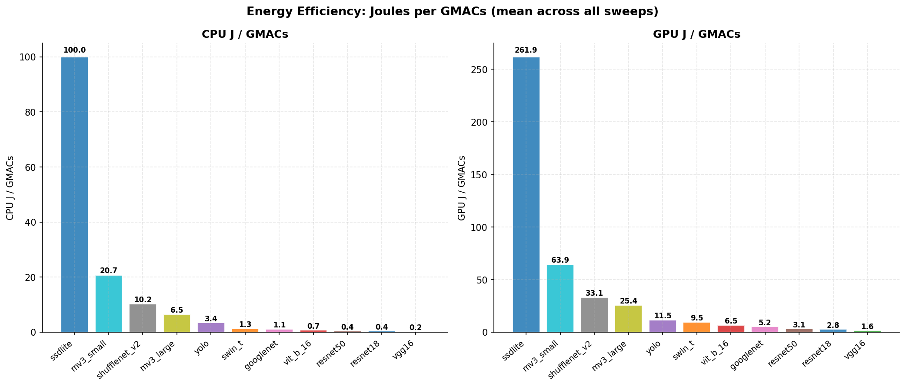

If we compute **J / GMACs** — energy spent per unit of useful computation — we get a counterintuitive ranking:

| Model | CPU J/GMACs | GPU J/GMACs |
|---|---|---|
| ssdlite | **100.0** | **261.9** |
| mobilenet_v3_small | 20.7 | 63.9 |
| shufflenet_v2_x1_0 | 10.2 | 33.1 |
| mobilenet_v3_large | 6.5 | 25.4 |
| yolo | 3.4 | 11.5 |
| swin_t | 1.3 | 9.5 |
| googlenet | 1.1 | 5.2 |
| vit_b_16 | 0.68 | 6.5 |
| resnet50 | 0.44 | 3.1 |
| resnet18 | 0.40 | 2.8 |
| vgg16 | **0.15** | **1.6** |

**The models designed to be "efficient" (MobileNet, ShuffleNet) are the least energy-efficient per GMACs.** VGG16 — the oldest, heaviest, most "wasteful" architecture — gets the most computation done per Joule.

This is not a contradiction. It reflects a fundamental property of GPU hardware:

- **Dense convolutions (VGG):** high arithmetic intensity — the GPU spends most of its time doing multiply-accumulate operations. Almost every clock cycle is useful work.
- **Depthwise separable convolutions (MobileNet, ShuffleNet):** low arithmetic intensity — the GPU spends most of its time waiting for memory. Many clock cycles are wasted on data movement. The MACs count is small, but the energy overhead per GMAC is large.
- **SSDLite:** the extreme case — its J/GMACs cost is ~650× higher than VGG16 for CPU. The vast majority of its CPU energy goes to NMS and detection post-processing, which MACs do not account for at all.

> **Key insight for the predictor:** MACs alone cannot predict energy across models. They are necessary but not sufficient. Model identity (or at minimum, architecture family) must be included as a feature to capture the structural differences in how efficiently models use their compute budget.

---

### 7.4 Is MACs a Useful Predictor Feature?

The utility of `macs_total` as a predictor feature depends on the type of predictor being trained:

**Per-model predictor (one model per architecture):** MACs are redundant. When model identity is fixed, `macs_total = constant(model) × resolution² × batch` — it is fully determined by features already present in the dataset. Including it would introduce multicollinearity without adding predictive information.

**Cross-model predictor (one model for all architectures):** MACs are partially useful — they compress model identity, resolution, and batch into a single continuous compute-load signal. However, the same MACs budget produces very different energy across architectures (e.g., ResNet18 and GoogLeNet at 224px have similar MACs yet a 3× CPU energy gap). MACs alone are insufficient — model family must be included alongside them.

**Predictor generalising to unseen models:** MACs become the most important feature. In the absence of model identity, MACs combined with parameter count and architecture family represent the best available static proxy for inference energy.

| Predictor type | MACs useful? |
|---|---|
| Per-model | No — redundant with resolution + batch |
| Cross-model (known models) | Partially — model identity required alongside |
| Generalising to new models | Yes — key feature |

This project currently trains per-model or per-family predictors, making `macs_total` largely redundant as a standalone feature. It is nonetheless worth retaining as a derived feature, since it encodes the interaction between model complexity, resolution, and batch in a single value — a useful signal for simpler regressors that cannot learn that interaction from raw features alone.

---

## 8. Summary of Key Findings

| Finding | Impact |
|---|---|
| GPU energy is 4–8× CPU energy on CUDA — GPU dominates total budget | Don't focus only on CPU energy; it's the smallest channel |
| I/O energy (22–34% of total) is large and often ignored in theory | Must be modelled, not discarded |
| Batch scaling differs strongly by model: near-linear for SSDLite/VGG16 and near-flat for MobileNet/YOLO in this benchmark setup; plausible causes include postprocess/runtime overheads vs overhead amortisation, but these mechanisms are interpretive without profiler confirmation | Batch is not a universal predictor feature — model-specific tuning is required |
| Resolution affects power and GPU energy significantly (r=0.34, 0.22) but barely affects CPU energy (r=0.05) | Resolution is a useful feature for GPU/power prediction |
| Reduced precision cuts GPU energy by ~20% overall, up to ~52% for Swin-T | Precision is critical for transformer energy modelling |
| Small models (MobileNet, YOLO) can be *worse* in fp16 for CPU energy | Precision effect must be modelled per model family |
| SSDLite: lowest power (11.68 W) but highest CPU energy (170 J) — power ≠ energy | Both dimensions needed for complete energy characterisation |
| MACs correlate well with power (r=0.58) but not with CPU energy (r=0.007) | Channel-specific predictors or features are essential |
| Within a model, MACs predict GPU energy very well (r > 0.83 for all models) | Resolution is a useful feature when model identity is fixed |
| Across models, J/GMACs spans 650×: VGG is most efficient, SSDLite least | More MACs ≠ more energy — architecture dominates raw compute count |
| Lightweight models (MobileNet, ShuffleNet) are the *least* energy-efficient per GMACs | Depthwise convolutions have high memory overhead, low arithmetic intensity |
